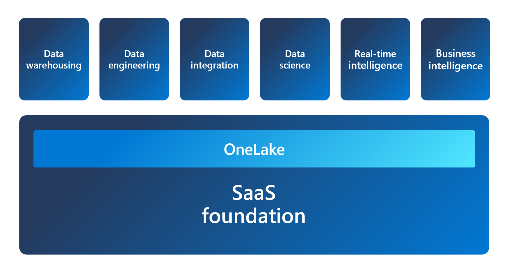
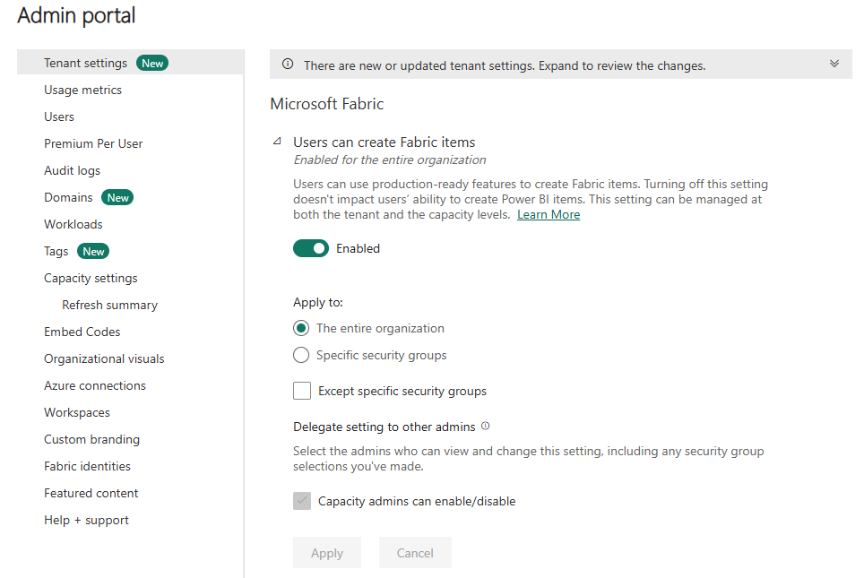
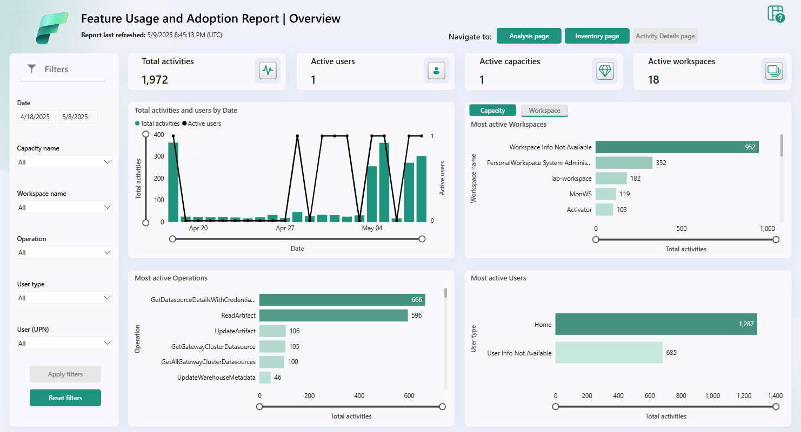

- [Module](https://learn.microsoft.com/en-us/training/modules/administer-fabric/)
- [Badge]()
- ---
- Microsoft Fabric is a SaaS solution for end-to-end data analytics. As an administrator, you can configure features and manage access to suit your organization's needs.
- ## Learning objectives
	- Describe Fabric admin tasks
	- Navigate the admin center
	- Manage user access
	- Govern data in Fabric
- # Introduction
	- As a Fabric administrator (admin), you need to know:
		- Fabric architecture
		- Security and governance features
		- Analytics capabilities
		- Deployment and licensing options
	- A Fabric admin needs to deal with:
		- Business users
		- Data analysts
		- IT professionals
		- Deployment and use of Fabric to achieve business objectives
		- Comply with organizational policies and standards
- # Understand the Fabric Architecture
	- Fabric is a SaaS that tries to integrate and do everything. An all-in-one analytics solution. Services include:
		- Data warehousing
		- Data engineering
		- Data integration
		- Data science
		- Real-time intelligence
		- Business intelligence
	- Data in Fabric is all stored in OneLake, build on Azure Data Lake Storage (ADLS) Gen2 architecture.
	- OneLake is hierarchical in nature to simplify management across your organization. There's only one OneLake per tenant and it provides a single-pane-of-glass file-system namespace that spans across users, regions, and even clouds.
	- 
	- > It sounds like this hierarquical nature may cause more mess than integration. Everything just thrown together.
- ## Understand Fabric concepts
	- **Tenant** is a dedicated space for organizations to create, store, and manage Fabric items. There's often a single instance of Fabric for an organization, which is aligned with Microsoft Entra ID. The Fabric *tenant* maps to the root of OneLake and is at the top level of the hierarchy.
	- **Capacity** is a dedicated set of resources that is available at a given time to be used. A tenant can have one or more capacities associated with it. Capacity defines the ability of a resource to perform an activity or to produce output. Capacity needs vary by item and duration of use. Fabric offers capacity through the Fabric SKU and Trials.
	- **Domain** is a logical grouping of workspaces. Domains are used to organize items in a way that makes sense for your organization. You can group things together in a way that makes it easier for the groups of people to have access to workspaces. For example, you might have a domain for sales, another for marketing, and another for finance.
	- **Workspace** is a collection of items that brings together different functionality in a single tenant. It acts as a container that uses capacity for the work that is executed, and provides controls for who can access the items in it. For example, in a sales workspace, users associated with the sales organization can create a 
	  data warehouse, run notebooks, create datasets, create reports, and more.
	- **Items** are the building blocks of the Fabric platform. They're the objects that you create and manage in Fabric. There are different types of items, such as data warehouses, data pipelines, datasets, reports, and dashboards.
- # Understand the Fabric administrator role
	- If you're a Microsoft 365 admin, a Power Platform admin, or a Fabric capacity admin, you're involved in administering Fabric. The Fabric admin role was formerly known as Power BI admin.
	- Tools to be familiarized with:
		- [Microsoft 365 admin center](https://learn.microsoft.com/en-us/microsoft-365/admin/admin-overview/admin-center-overview)
		- [Microsoft 365 Security & Microsoft Purview compliance portal](https://learn.microsoft.com/en-us/microsoft-365/compliance/microsoft-365-compliance-center)
		- [Microsoft Entra ID in the Azure portal](https://learn.microsoft.com/en-us/azure/active-directory/fundamentals/active-directory-whatis)
		- [PowerShell cmdlets](https://learn.microsoft.com/en-us/powershell/power-bi/overview)
		- [Administrative APIs and SDK](https://learn.microsoft.com/en-us/rest/api/power-bi/admin)
- ## Describe admin tasks
	- **Security and access control:** Managing security and access control to ensure that only authorized users can access sensitive data. You can use role-based access control (RBAC) to:
		- Define who can view and edit content.
		- Set up data gateways to securely connect to on-premises data sources.
		- Manage user access with Microsoft Entra ID.
	- **Data governance:** Solid understanding of data governance principles. You should know how to secure inbound and outbound connectivity in your tenant and how to monitor usage and performance metrics. You should also know how to apply data governance policies to ensure data within your tenant is only accessible to authorized users.
	- **Customization and configuration:** Customizing and configuring the platform to meet the needs of your organization. You might configure private links to secure your tenant, define data classification policies, or adjust the look and feel of reports and dashboards.
	- **Monitoring and optimization:** Monitor the performance and usage of the platform, optimize resources, and troubleshoot issues. Examples include configuring monitoring and alerting settings, optimizing query performance, managing capacity and scaling, and troubleshooting data refresh and connectivity issues.
- ## Describe admin tools
- ### Fabric admin portal
	- Web-based
	- Centralizes all management aspects of Fabric
	- Manage, review, apply setting for the entire tenant or by capacity.
	- Manage users, admins, groups
	- Access audit logs
	- Monitor usage and performance
	- Settings abound
	- Fabric on/off switch to use Power BI into Fabric
	- 
- ### PowerShell cmdlets
	- Fabric provides a set of *[PowerShell cmdlets](https://learn.microsoft.com/en-us/powershell/scripting/powershell-commands)* that you can use to automate common administrative tasks. A PowerShell cmdlet is a simple command that can be executed in PowerShell.
	- For example, you can use cmdlets in Fabric to systematically create and manage groups, configure data sources and gateways, and monitor usage and performance. You can also use the cmdlets to manage the Fabric admin APIs and SDKs.
- ### Admin APIs and SDKs
	- For example, you can use APIs and SDKs to create and manage groups, configure data sources and gateways, and monitor usage and performance. You can also use the APIs and SDKs to manage the Fabric admin APIs and SDKs.
	- You can make these requests using any HTTP client library that supports OAuth 2.0 authentication, such as Postman, or you can use PowerShell scripts to automate the process.
- ### Admin monitoring workspace
	- The admin monitoring workspace includes the Feature Usage and Adoption dataset and report, which together provide insights on the usage and performance of your Fabric environment.
	- 
- # Manage Fabric security
	-