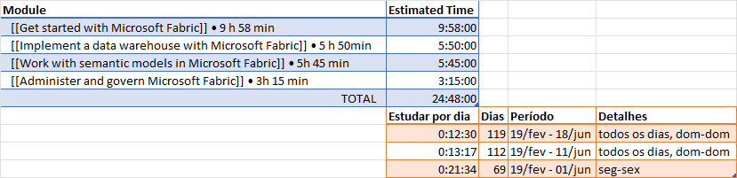

tags:: [[microsoft-learning]], [[data-eng]]

- # [Microsoft Fabric Analytics Engineer](https://learn.microsoft.com/en-us/credentials/certifications/fabric-analytics-engineer-associate/?practice-assessment-type=certification&source=learn#certification-prepare-for-the-exam)
	- DONE [[Get started with Microsoft Fabric]] • 9 h 58 min
	  background-color:: yellow
	  :LOGBOOK:
	  CLOCK: [2025-02-10 Mon 21:32:47]--[2025-02-10 Mon 21:40:18] =>  00:07:31
	  CLOCK: [2025-02-10 Mon 21:40:20]--[2025-06-04 Wed 09:56:41] =>  2724:16:21
	  :END:
	- DOING [[Implement a data warehouse with Microsoft Fabric]] • 5 h 50min
	  background-color:: red
	  :LOGBOOK:
	  CLOCK: [2025-06-04 Wed 10:09:56]
	  :END:
	- TODO [[Work with semantic models in Microsoft Fabric]] • 5h 45 min
	  background-color:: pink
	- TODO [[Administer and govern Microsoft Fabric]] • 3h 15 min
	  background-color:: green
- # Study Plan
- 