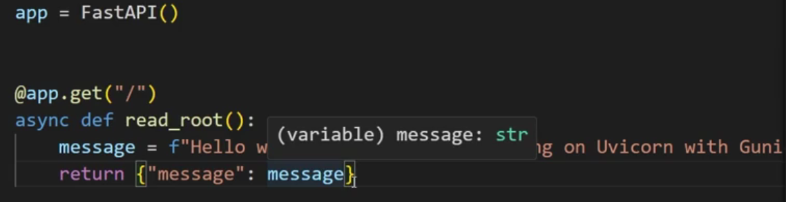

tags:: [[jornada-dados]]

- # Perguntas diversas
	- ## Qual a diferença entre *terraform* e *kubernetes*?
		- *terraform*: cuida da infraestrutura da cloud
		- *kubernetes*: cuida do Dockerfile
		  id:: 66fdafb8-ef2e-4444-a431-e37c5070cbc3
	- ## Por que async?
		- 
		- Com o *async*, dá pra fazer, por exemplo, diversas requisições usando a lib requests sem esperar cada uma terminar de rodar.
		- Por que fazer isso? Se os seus requests dependem somente da página que você quer acessar, neste caso.
		- Aliás, com o FastAPI dá para encapsular requests de cientistas de dados e transformar em API, acredito que isso bate com o princípio de boa arquitetura de dados, com áreas que são "loosely coupled".
	- ## Como saber o que posso baixar e rodar no Docker?
		- No https://hub.docker.com/ tem muitas imagens disponíveis.
		- ```bash
		  docker pull mysql
		  ```
- # Múltiplos contâineres com docker-compose.yml
	- O docker-compose é usado pra subir mais de um contâiner de uma vez só. É uma versão primitiva do *kubernetes*. Ex.: subir PostgreSQL e o pgAdmin 4 pra acessar o banco.
	- `20:01`
- # Referências
	- https://renatogroffe.medium.com/postgresql-pgadmin-4-docker-compose-montando-rapidamente-um-ambiente-para-uso-55a2ab230b89