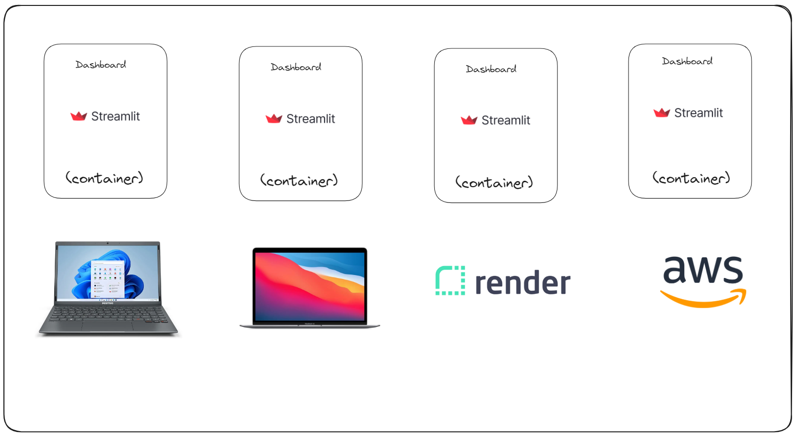

id:: 66f1fadd-a187-41a8-896e-07e0491b6d18
tags:: jornada-dados, [[data-eng]]

- instructor:: [[luciano-galvao]]
- # Por que o Docker?
	- Docker veio para ajudar a fazer *deploy* de apps (qualquer coisa que rode é um aplicativo, seja ETL, dashboard, etc.)
	- Com o Docker, o mesmo código roda na máquina local, na máquina do seu colega, no *Render* e também na *AWS*!
	- 
	- Docker roda a Docker engine, que é um kernel do Linux. O Docker roda Linux!
	- A ideia do Docker é que o container você faz como um git pull de imagens de aplicativos que deseja usar, e não é preciso instalar na unha, as configs do setup vêm na imagem.
	- O Docker usa o Open CI[^1] (Open Container Initiative) para construir os containers.
- # Como o Docker funciona?
	- 
	- Docker e Podman usam Open CI e são equivalentes.
	- O *code* é o teu código, teu software.
	- O *dockerfile* é uma solução para todo o setup de criação de ambiente
		- e.g.: setup de ambiente python
		  ```bash
		  git clone ...
		  cd ...
		  pyenv local 3.12.1
		  pip install pipx
		  pipx install poetry
		  poetry env use 3.12.1
		  poetry add pandas
		  .
		  .
		  .
		  ```
	- A *imagem* é um linux com teu código na pasta `/src` e python instalado
	- A *imagem* é como a classe (forma) e o *container* é a instância (biscoito) da *imagem*
- # Buildando primeiro docker
	- Do que precisamos?
		- `dockerfile`
		- `code`
		- `.dockerignore`
	- Depois de terminar esses arquivos:
		- Crie imagem
		  ```bash
		  docker build -t docker-demo .
		  ```
		- Crie container
		  ```bash
		  docker run -d -p 8501:8501 --name docker-demo docker-demo
		  ```
		- `-d`: deattach command from terminal (command doesn't "freeze" terminal)
	- No Docker, é necessário compilar toda vez que tem modificação no código.
- # Docker first
	- O docker diminui drasticamente o tempo pra fazer setup e onboarding porque vai trazer certinho todas as libs com as versões certas.
	  ```bash
	  git clone ...
	  cd ...
	  docker build ...
	  docker run ...
	  ```
	- `Dockerfile` é o `yaml` do CI (Continuous Integration)
- # Enviar para o Render (ambiente de QA)
  timestamp:: 00:52:00
	- ## O que é Render?
		- Render[^2] é uma *cloud* que tem tipo gratuito. É como um nível abaixo da Microsoft e da AWS.
		- Heroku era uma cloud que tinha tier gratuito. A Salesforce tirou a gratuidade e outros provedores, como Render, surgiu.
	- ## CI/CD com Render
		- Conectar repo *git* ao *Render* e bloquear a *main* para que receba *commits* somente de PR. Já tem a checagem, o PR e integração com o *Render*. Com isso, já tem uma estrutura completa e básica de **CI/CD** (*Continuous Integration/Continuous Delivery*).
- # AWS
	- Atentar para diferença entre pagar por processamento e por tempo ligado.
	- Terminating and stopping an instance is different. Terminating is eliminating the machine, stopping just puts the machine to sleep, but it still "exists".
	- AWS usa SSH que nem o GitHub e o MySQL.
	- ## Continuous Delivery na AWS
		- GitHub actions e algumas configurações para atualizar automático o dashboard na AWS quando tem atualizações.
- # Referências
	- [^1]: https://opencontainers.org/ "Open Containers Initiative"
	- [^2]: https://render.com/