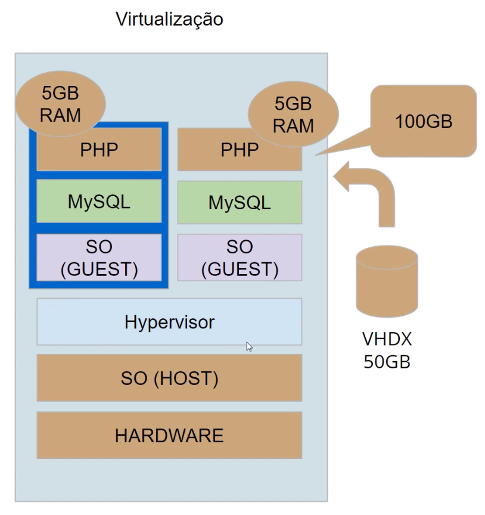
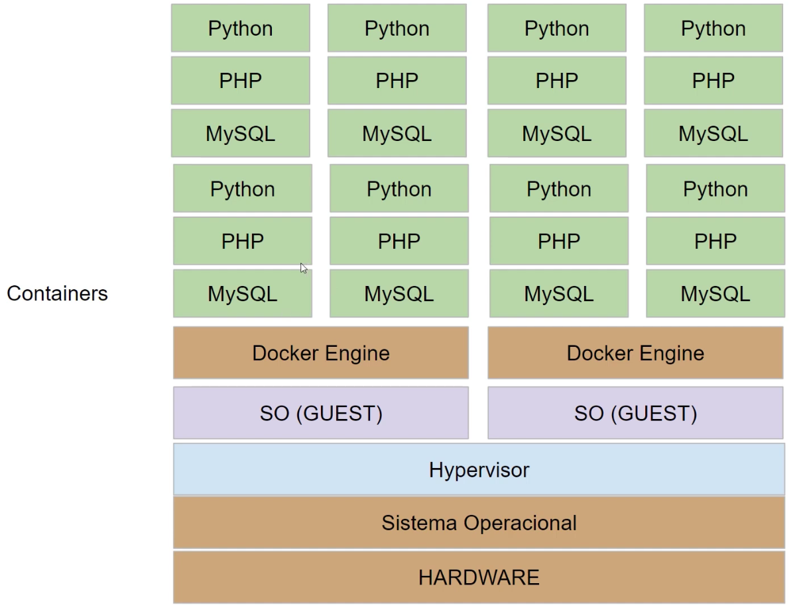

tags:: [[dio/docker]], [[data-eng]]

- instructor:: [[denilson-bonatti]]
- # Intro a Docker e containers
	- ## Modelo cliente-servidor
		- Quem são os clientes? app no celular, web, etc. (front-end)
		- O que é o servidor? servidor, data center, cloud (GCP, AWS, Azure) (back-end)
	- ## Virtualização
		- Software que divide o hardware em partes, de modo que um servidor físico pode ser vários servidores virtuais. Assim, dá para otimizar o uso do servidor, dividindo um servidor de acordo com a necessidade do serviço que vai usar e oferecendo mais recursos pra um recurso mais pesado.
		- 
		- VHDX: Virtual HD
		- Hypervisor: software de virtualização
		- Máquina virtual ainda é um pouco lenta.
	- ## Microserviços
		- Software Monolítico: software desenvolvido em um único código
			- Software fica muito complexo e grande
			- Solução é... Microserviços!
		- ### O que são microserviços?
			- Quebrar um código grande em várias partes menores que cuidam somente de uma função.
			- Abordagem de arquitetura e organização do desenvolvimento de software de monolítico para serviços independentes que se comunicam por meio de APIs.
		- ### Vantagens de microserviços
			- Equipes podem trabalhar em parte específica do código.
			- Facilita escalabilidade (duplicar *container* que faz serviço específico que está sobrecarregado)
			- Agiliza desenvolvimento de novas features
	- ## Container
		- Caixa com código que oferece um serviço específico que possui somente o mínimo de informação para rodar a aplicação em qualquer sistema operacional [^1]
		- O Docker resolveu o problema de gerenciar os microserviços com os containers.
	- 
	- O sistema operacional do guest normalmente é LINUX porque é mais rápido.
	- ## Qual a diferença entre virtualização e containers?
		- **VIRTUALIZAÇÃO:** executa mais de um SO em um único hardware. O SO é diferente do "original" do hardware.
		- **CONTAINER:** compartilham o mesmo kernel do SO e isolam os processos da aplicação do resto do sistema. O Docker cria os containers para rodarem *sobre* o SO que está rodando o Docker.
- # Referências
	- [^1]: https://www.hpe.com/us/en/what-is/containers.html