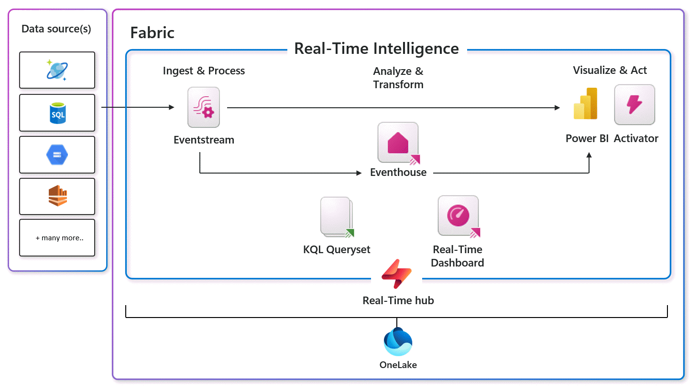
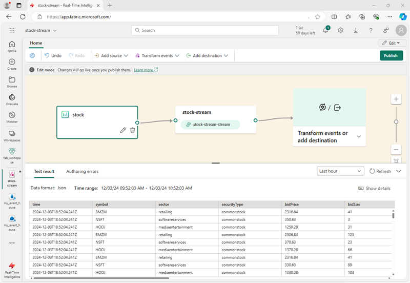

- [Module](https://learn.microsoft.com/en-us/training/modules/get-started-kusto-fabric/)
- [Badge]()
- ## Learning Objectives
	- Understanding core concepts related to real-time data analytics.
	- Understanding  Microsoft Fabric's Real-Time Intelligence capabilities.
	- Exploring core components of Real-Time Intelligence in Microsoft Fabric.
	- Ingesting real-time data by using an *eventstream*.
	- Using an *eventhouse* and a KQL database for real-time data analysis in Microsoft Fabric.
	- Visualizing data in *real-time dashboards*.
	- Using *Activator* in Microsoft Fabric to define alerts that trigger automated actions.
- # Introduction
	- Two patterns for data analytics:
		- **Batch data analytics**, in which data is loaded into an analytical data store at periodic intervals as a batch operation; enabling historical analysis of data from past events.
		- **Real-time data analytics**, in which data from events is ingested in real-time (or *near* real-time) as events occur in a *stream* of data that can be analyzed, visualized, and used to trigger automated responses.
	- Implementing real-time data analytics through *lambda* architecture that combines the periodic loading of batch data for historical analysis with the ingestion of data streams for real-time analysis.
- # What is real-time data analytics?
	- *Stream processing* of data sends data continually, to create (near) real-time visualizations, graphs, KPIs.
	- It can be used for monitoring purposes of for triggering automated actions based on certain conditions.
	- > **Stream processing** the integer equivalent of **batch processing**.
	- Common goals for real-time analytics include:
		- Continuously analyzing data to report issues or trends.
		- Understanding component or system behavior under various conditions to help plan future enhancements.
		- Triggering specific actions or alerts when certain events occur or thresholds are exceeded.
- ### Characteristics of real-time data analytics solutions
	- Stream processing solutions for real-time data analytics
	- Common characteristics:
		- A data stream is *unbounded* - data is added to the stream perpetually.
		  logseq.order-list-type:: number
		- Data records in the stream typically include *temporal* (time-based) data indicating when the event to which the record relates occurred (or was recorded).
		  logseq.order-list-type:: number
		- Aggregation of streaming data is often performed over temporal *windows* - for example, recording the number of social media posts per minute or the average rainfall per hour.
		  logseq.order-list-type:: number
		- The results of streaming data processing can be used to support real-time (or *near* real-time) automation or visualization, or persisted in an analytical store to be combined with other data for historical analysis. Many solutions combine these approaches to support both real-time and historical analytics.
		  logseq.order-list-type:: number
		- 
- # Real-Time Intelligence in Microsoft Fabric
	- Using the Microsoft Fabric Real-Time Intelligence, you can:
		- Create an *eventstream* to capture, transform, and ingest real-time data from various streaming sources.
		- Store captured real-time data in an *eventhouse*, which includes one or more *KQL databases*.
		- Query and analyze data in the eventhouse by using KQL queries, organized in a *KQL queryset*.
		- Visualize real-time data in a *real-time dashboard* or by using Power BI.
		- Configure alerts that use *Activator* to trigger automated actions.
	- 
- ## The Microsoft Fabric real-time hub
	- The real-time hub is where you manage the real-time data sources.
	- In the real-time hub, you can:
		- Find and connect to real-time data sources and create *eventstreams*.
		- Subscribe to Fabric and Azure events, and create *eventstreams* and *Activator* alerts.
		- Preview and manage your real-time data connections, including navigating to captured stream data in an *eventhouse*.
		- Create *real-time dashboards* from event streams.
		- Endorse and share real-time data resources across your organization.
- # Ingest and transform real-time data
	- Eventstreams are basically streaming data pipelines with a fancy name. They perform ETL tasks and can connect to various streams of data.
	- 
- ## Data sources for eventstreams
	- **External services**, like Azure Storage, Azure Event Hubs, Azure IoT Hubs, Apache Kafka hubs, Change Data Capture (CDC) feeds in relational database services, and others.
	- **Fabric events**, such as changes to items in a Fabric workspace, data changes in OneLake data stores, and events associated with Fabric jobs.
	- **Sample data**, which includes a range of samples that can help you explore real-time analytics scenarios in Microsoft Fabric.
- ## Data transformations in eventstreams
  id:: 683470ba-2985-4e54-b39e-036ea6ca3989
	- **Filter:** Use the Filter transformation to filter events based on the value of a field in the input. Depending on the data type (number or text), the transformation keeps the values that match the selected condition, such as is null or is not null.
	- **Manage fields:** This transformation allows you to add, remove, change data type, or rename fields coming in from an input or another transformation.
	  Aggregate: Use the Aggregate transformation to calculate an aggregation (Sum, Minimum, Maximum, or Average) every time a new event occurs over a period of time. This operation also allows for the renaming of these calculated columns, and filtering or slicing the aggregation based on other dimensions in your data. You can have one or more aggregations in the same transformation.
	- **Group by:** Use the Group by transformation to calculate aggregations across all events within a certain time window. You can group by the values in one or more fields. It's like the Aggregate transformation allows for the renaming of columns, but provides more options for aggregation and includes more complex options for time windows. Like Aggregate, you can add more than one aggregation per transformation.
	- **Union:** Use the Union transformation to connect two or more nodes and add events with shared fields (with the same name and data type) into one table. Fields that don't match are dropped and not included in the output.
	  Expand: Use this array transformation to create a new row for each value within an array.
	- **Join:** this is a transformation to combine data from two streams based on a matching condition between them.
- ## Data destinations in eventstreams
	- **Eventhouse**: This destination lets you ingest your real-time event data into an eventhouse, where you can use Kusto Query Language (KQL) to query and analyze the data.
	- **Lakehouse**: This destination gives you the ability to transform your real-time events before ingesting them into your lakehouse. Real-time events convert into Delta Lake format and then store in the designated lakehouse tables.
	- **Derived stream**: Derived stream is used to redirect the output of your eventstream to another eventstream. The derived stream represents the transformed default stream following stream processing.
	- **Fabric Activator**: This destination lets you directly connect your real-time event data to a Fabric Activator; which is an intelligent agent that can automate actions based on values in the stream.
	- **Custom endpoint**: With this destination, you can route your real-time events to a custom endpoint. This destination is useful when you want to direct real-time data to an external system or custom application outside Microsoft Fabric.
- # Store and query real-time data
	- Eventhouses are storages for real-time data, often ingested by an eventstream and loaded into tables for further processing and analysis.
	- Create in an eventhouse:
		- **KQL databases**: real-time optimized data stores that host a collection of tables, stored functions, materialized views, and shortcuts.
		- **KQL querysets**: Collections of KQL queries that you can use to work with data in KQL database tables. A KQL queryset supports queries written using Kusto Query Language (KQL) and a subset of the Transact-SQL language.
- ## Querying data
	- KQL databases -> Kusto Query Language (KQL)
	- KQL is a read-only request to process data and return results (query).
- ### KQL query statements
	- A query statement consists of a table name followed by one or more operators that `take`, `filter`, `transform`, `aggregate`, or `join` data. For example, the following query retrieves 10 rows from a table named **stock**:
	  id:: 6834726b-0ca1-4e3d-a100-92289cc1b9bd
	  ```kql
	  stock
	  | take 10
	  ```
	- A more complex example might aggregate the data to find the average stock price per stock symbol in the last five minutes:
	  ```kql
	  stock
	   | where ["time"] > ago(5m)
	   | summarize avgPrice = avg(todecimal(bidPrice)) by symbol
	   | project symbol, avgPrice
	  ```
	- KQL is optimized for querying large volumes of data, especially when filtering through time.
- ### Using SQL
	- Equivalent SQL to the *take 10* KQL [above](((6834726b-0ca1-4e3d-a100-92289cc1b9bd))):
	  ```sql
	  SELECT TOP 10 * FROM stock;
	  ```
- ### Using Copilot to help with queries
	- Microsoft Fabric includes Copilot for Real-Time Intelligence.
- # Visualize real-time data
	-