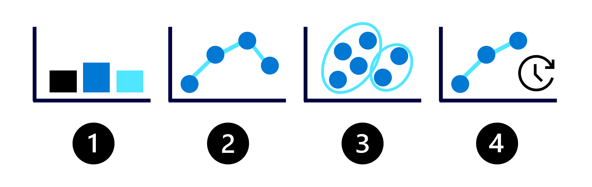
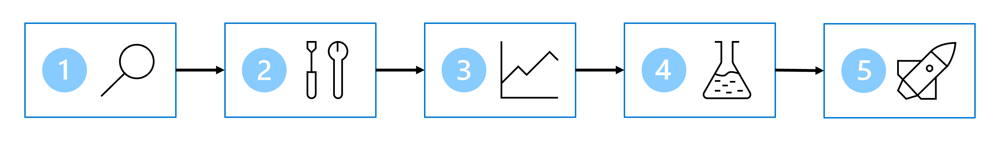

## Learning objectives
	- Understand the data science process
	- Train models with notebooks in Microsoft Fabric
	- Track model training metrics with MLflow and experiments
- # Introduction
	- **Data science** is a combination of mathematics, statistics, and computer engineering.
	- You can use data science to create **artificial intelligence (AI)** models that encompass the complicated patterns you find in your data.
	- A common approach is to use data science to train **machine learning (ML)** models using libraries like `scikit-learn` in Python to achieve AI.
	- In this module, you learn about a typical data science project. Additionally, you explore which Microsoft Fabric features you can use for each part of the data science process.
- # Understand the data science process
	- Extract insights or predictions from the data. Visualization is the most common way. Data scientists can use statistics and mathematics as tools to find patterns invisible through visualization alone.
	- Though training the model is important, it's not the only task in a data science project. Before exploring a typical data science process, let's explore common machine learning models you can train.
- ## Explore common machine learning models
	- The purpose of ML is to find patterns in data through the training of models.
	- Four common types of ML models are shown below:
		- 
		- **Classification**: Predict a categorical value like whether a customer may churn.
		  logseq.order-list-type:: number
		- **Regression**: Predict a numerical value like the price of a product.
		  logseq.order-list-type:: number
		- **Clustering**: Group similar data points into clusters or groups.
		  logseq.order-list-type:: number
		- **Forecasting**: Predict future numerical values based on time-series data like the expected sales for the coming month.
		  logseq.order-list-type:: number
	- To choose a model for training, you first need to understand the business problem and the data available.
- ## Understand the data science process
	- Common processes for training a model:
		- 
		- **Define the problem**: Together with business users and analysts, decide on what the model should predict and when it's successful.
		  logseq.order-list-type:: number
		- **Get the data**: Find data sources and get access by storing your data in a Lakehouse.
		  logseq.order-list-type:: number
		- **Prepare the data**: Explore the data by reading it from a Lakehouse into a notebook. Clean and transform the data based on the model's requirements.
		  logseq.order-list-type:: number
		- **Train the model**: Choose an algorithm and hyperparameter values based on trial and error by tracking your experiments with MLflow.
		  logseq.order-list-type:: number
		- **Generate insights**: Use model batch scoring to generate the requested predictions.
		  logseq.order-list-type:: number
	- As a data scientist, most of your time is spent on preparing the data and training the model. How you prepare the data and which algorithm you choose to train a model can influence your model's success.
	- You can prepare and train a model by using open-source libraries available for the language of your choice. For example, if you work with Python, you can prepare the data with Pandas and Numpy, and train a model with libraries like [Scikit-Learn](https://scikit-learn.org/stable/), [PyTorch](https://pytorch.org/), or [SynapseML](https://microsoft.github.io/SynapseML/).
	- When experimenting, you want to keep an overview of all the different models you've trained. You want to understand how your choices influence the model's success. By tracking your experiments with MLflow in Microsoft Fabric, you're able to easily manage and deploy the models you've trained.
- # Explore and process data with Microsoft Fabric
	- Data quantity and quality are crucial.
	- Main data pipelines:
		- data ingestion pipelines
		- data exploration pipelines
		- data transformation pipelines
- ## Ingest your data into Microsoft Fabric
	- Various sources can be used for ingestion:
		- CSV file on local machine
		- Azure Data Lake Storage (Gen2)
	- After connecting to the source, you can save the data into a Miccrosoft Fabric *lakehouse*.
	- The *lakehouse* can serve as a central location to store any structured, semi-structured, and unstructured files. You can then easily connect to the lakehouse 
	  whenever you want to access your data for exploration or transformation.
- ## Explore and transform your data
	- **Notebook** experience, powered by Spark compute.
	- **Apache Spark** is an open source parallel processing framework for large-scale data processing and analytics.
	- Notebooks are automatically attached to Spark compute.
	- You can choose the language you want to use. For data science workloads, you're likely to work with PySpark (Python) or SparkR (R).
- ### Prepare your data with the Data Wrangler
	- **Data Wrangler:** use it to explore and transform your data more quickly.
	- After launching the Data Wrangler, you'll get a descriptive overview of the data you're working with. You can view the summary statistics of your data to find any issues like missing values.
	- To clean your data, you can choose any of the built-in data-cleaning operations. When you select an operation, a preview of the result and the associated code is automatically generated for you. When you have selected all necessary operations, you can export the transformations to code and execute it on your data.
- # Train and score models with Microsoft Fabric
	- After exploring and preprocessing the data, it can be used for training a model.
	- Training a model is an iterative process, so it is useful to be able to track your work.
	- Microsoft FAbric integrates with MLflow to track and log ML training.
	- Any ML training work is called an **experiment**.
- ## Understand experiments
	- Whenever you train a model in a notebook that you want to track, you create an experiment in Microsoft Fabric.
	- An experiment can consist of multiple runs. Each **run** represents a task you executed in a notebook, like training a machine learning model.
	- For example, to train a machine learning model for sales forecasting, you can try different training datasets with the same algorithm. Each time you train a model with a different dataset, you create a new experiment run. Then, you can compare the experiment runs to determine the best performing model.
- ### Start tracking metrics
	- To compare experiment runs, you can track parameters, metrics, and artifacts for each run.
	- By tracking your work with MLflow, you can compare model training iterations and decide which configuration resulted in the best model for your use case.
- ## Understand models
	-