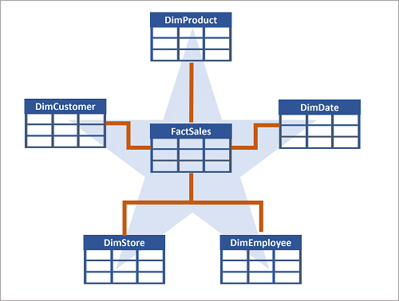

- **Data warehouses** are *analytical stores* built on a *relational schema* to *support SQL queries*.
- Microsoft Fabric enables you to create a relational data warehouse in your workspace and integrate it easily with other elements of your end-to-end analytics solution.
- ## Learning objectives
	- Describe data warehouses in Fabric.
	- Understand a data warehouse vs a data Lakehouse.
	- Work with data warehouses in Fabric.
	- Create and manage fact tables and dimensions within a data warehouse.
- # Introduction
	- **Relational data warehouse** can be characterized by its standard design of a denormalized, multidimensional schema.
	- **Microsoft Fabric's data warehouse** centralizes and organizes data from different departments, systems, and databases into a single view for analysis and reporting purposes.
	- Fabric's data warehouse is unique because it's built on the Lakehouse, which is stored in Delta format and can be queried using SQL. It's designed for use by the whole data team, not just data engineers.
- # Understand data warehouse fundamentals
	- The process of building a modern data warehouse typically consists of:
		- Data ingestion - moving data from source systems into a data warehouse.
		- Data storage - storing the data in a format that is optimized for analytics.
		- Data processing - transforming the data into a format that is ready for consumption by analytical tools.
		- Data analysis and delivery - analyzing the data to gain insights and delivering those insights to the business.
- ## Understand Fabric's data warehouse experience
	- You can use SQL to query and analyze the data, or use Spark to process the data and create machine learning models.
	- Data warehouses in Fabric facilitate collaboration between data engineers and data analysts, working together in the same experience.
	- Data engineers build a relational layer on top of data in the Lakehouse, where analysts can use T-SQL and Power BI to explore the data.
- ## Design a data warehouse
	- Data warehouse has tables organized in schemas optimized for multidimensional modeling.
	- **Multidimensional modeling** organizes data into cubes with dimensions (e.g., time, product, location) and measures (e.g., sales, revenue) for efficient analytical queries. It supports complex aggregations and slicing/dicing in data warehouses.
	- > **Multidimensional modeling example**
	  x = datetime
	  y = location
	  z = product id
	  The value could be sales amount or quantity sold.
	  
- ### Tables in a data warehouse
	- **Dimensional modeling:** structure tables into fact and dimensions tables. Supports efficient and effective analysis of large amounts of data.
	- **Fact tables** contain the numerical data that you want to analyze. Fact tables typically have a large number of rows and are the primary source of data for analysis. For example, a fact table might contain the total amount paid for sales orders that occurred on a specific date or at a particular store.
	- **Dimension tables** contain descriptive information about the data in the fact tables. Dimension tables typically have a small number of rows and are used to provide context for the data in the fact tables. For example, a dimension table might contain information about the customers who placed sales orders.
		- **Dimension tables** contain a unique key column. It's common to include two key columns:
		- A *surrogate key* is a unique identifier for each row in the dimension table. It's often an integer value that is automatically generated by the database management system when a new row is inserted into the table.
		- An *alternate key* is often a natural or business key that identifies a specific instance of an entity in the transactional source system - such as a product code or a customer ID.
		- You need both surrogate and alternate keys in a data warehouse, because they serve different purposes. Surrogate keys are specific to the data warehouse and help to maintain consistency and accuracy in the data. Alternate keys on the other hand are specific to the source system and help to maintain traceability between the data warehouse and the source system.
- ### Data warehouse schema designs
	- In a data warehouse, the data is generally *de-normalized* to reduce the number of joins required to query the data.
	- In most transactional databases, data is *normalized* to reduce duplication.
	- **Star schema:** from a fact table, dimension tables are created "around" it.
	  
	- **Snowflake schema:** a star schema, but dimension tables can have relationships between each other and be derived from each other.
	  
	- In this case, the **DimProduct** table has been split up (normalized) to create separate dimension tables for product categories and suppliers.
		- Each row in the **DimProduct** table contains key values for the corresponding rows in the **DimCategory** and **DimSupplier tables**.
	- A **DimGeography** table has been added containing information on where customers and stores are located.
		- Each row in the **DimCustomer** and **DimStore** tables contains a key value for the corresponding row in the **DimGeography** table.
- # Understand data warehouses in Fabric
	- Fabric's Lakehouse is a collection of files, folders, tables, and shortcuts that act **like a database over a data lake**. It's used by the Spark engine and SQL engine for big data processing and has features for ACID transactions when using the open-source Delta formatted tables.
	- Fabric's data warehouse experience allows you to transition from the **lake view of the Lakehouse (which supports data engineering and Apache Spark)** to the **SQL experiences that a traditional data warehouse would provide**. The Lakehouse gives you the ability to read tables and use the SQL analytics endpoint, whereas the data warehouse enables you to manipulate the data.
	- In the data warehouse experience, you'll model data using tables and views, run T-SQL to query data across the data warehouse and Lakehouse, use T-SQL to perform DML operations on data inside the data warehouse, and serve reporting layers like Power BI.
	-