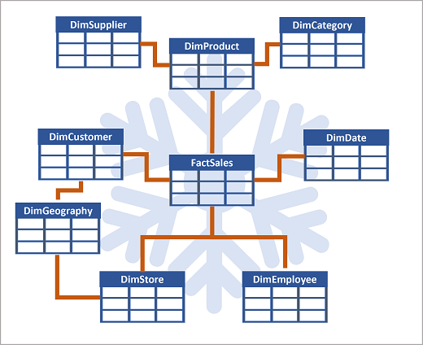

- [Module](https://learn.microsoft.com/en-us/training/modules/get-started-data-warehouse/)
- [Badge]()
- ---
- **Data warehouses** are *analytical stores* built on a *relational schema* to *support SQL queries*.
- Microsoft Fabric enables you to create a relational data warehouse in your workspace and integrate it easily with other elements of your end-to-end analytics solution.
- ## Learning objectives
	- Describe data warehouses in Fabric.
	- Understand a data warehouse vs a data Lakehouse.
	- Work with data warehouses in Fabric.
	- Create and manage fact tables and dimensions within a data warehouse.
- # Introduction
	- **Relational data warehouse** can be characterized by its standard design of a denormalized, multidimensional schema.
	- **Microsoft Fabric's data warehouse** centralizes and organizes data from different departments, systems, and databases into a single view for analysis and reporting purposes.
	- Fabric's data warehouse is unique because it's built on the Lakehouse, which is stored in Delta format and can be queried using SQL. It's designed for use by the whole data team, not just data engineers.
- # Understand data warehouse fundamentals
	- The process of building a modern data warehouse typically consists of:
		- Data ingestion - moving data from source systems into a data warehouse.
		- Data storage - storing the data in a format that is optimized for analytics.
		- Data processing - transforming the data into a format that is ready for consumption by analytical tools.
		- Data analysis and delivery - analyzing the data to gain insights and delivering those insights to the business.
- ## Understand Fabric's data warehouse experience
	- You can use SQL to query and analyze the data, or use Spark to process the data and create machine learning models.
	- Data warehouses in Fabric facilitate collaboration between data engineers and data analysts, working together in the same experience.
	- Data engineers build a relational layer on top of data in the Lakehouse, where analysts can use T-SQL and Power BI to explore the data.
- ## Design a data warehouse
	- Data warehouse has tables organized in schemas optimized for multidimensional modeling.
	- **Multidimensional modeling** organizes data into cubes with dimensions (e.g., time, product, location) and measures (e.g., sales, revenue) for efficient analytical queries. It supports complex aggregations and slicing/dicing in data warehouses.
	- > **Multidimensional modeling example**
	  x = datetime
	  y = location
	  z = product id
	  The value could be sales amount or quantity sold.
	  
- ### Tables in a data warehouse
	- **Dimensional modeling:** structure tables into fact and dimensions tables. Supports efficient and effective analysis of large amounts of data.
	- **Fact tables** contain the numerical data that you want to analyze. Fact tables typically have a large number of rows and are the primary source of data for analysis. For example, a fact table might contain the total amount paid for sales orders that occurred on a specific date or at a particular store.
	- **Dimension tables** contain descriptive information about the data in the fact tables. Dimension tables typically have a small number of rows and are used to provide context for the data in the fact tables. For example, a dimension table might contain information about the customers who placed sales orders.
		- **Dimension tables** contain a unique key column. It's common to include two key columns:
		- A *surrogate key* is a unique identifier for each row in the dimension table. It's often an integer value that is automatically generated by the database management system when a new row is inserted into the table.
		- An *alternate key* is often a natural or business key that identifies a specific instance of an entity in the transactional source system - such as a product code or a customer ID.
		- You need both surrogate and alternate keys in a data warehouse, because they serve different purposes. Surrogate keys are specific to the data warehouse and help to maintain consistency and accuracy in the data. Alternate keys on the other hand are specific to the source system and help to maintain traceability between the data warehouse and the source system.
- ### Data warehouse schema designs
	- In a data warehouse, the data is generally *de-normalized* to reduce the number of joins required to query the data.
	- In most transactional databases, data is *normalized* to reduce duplication.
	- **Star schema:** from a fact table, dimension tables are created "around" it.
	  
	- **Snowflake schema:** a star schema, but dimension tables can have relationships between each other and be derived from each other.
	  
	- In this case, the **DimProduct** table has been split up (normalized) to create separate dimension tables for product categories and suppliers.
		- Each row in the **DimProduct** table contains key values for the corresponding rows in the **DimCategory** and **DimSupplier tables**.
	- A **DimGeography** table has been added containing information on where customers and stores are located.
		- Each row in the **DimCustomer** and **DimStore** tables contains a key value for the corresponding row in the **DimGeography** table.
- # Understand data warehouses in Fabric
	- Fabric's Lakehouse is a collection of files, folders, tables, and shortcuts that act **like a database over a data lake**. It's used by the Spark engine and SQL engine for big data processing and has features for ACID transactions when using the open-source Delta formatted tables.
	- Fabric's data warehouse experience allows you to transition from the **lake view of the Lakehouse (which supports data engineering and Apache Spark)** to the **SQL experiences that a traditional data warehouse would provide**. The Lakehouse gives you the ability to read tables and use the SQL analytics endpoint, whereas the data warehouse enables you to manipulate the data.
	- In the data warehouse experience, you'll model data using tables and views, run T-SQL to query data across the data warehouse and Lakehouse, use T-SQL to perform DML operations on data inside the data warehouse, and serve reporting layers like Power BI.
- ## Ingest data into your data warehouse
- ### Table considerations
	- *Staging tables* are temporary and can be used for cleaning, transforming and validating the data before inserting the data into a created table in the data warehouse. They can also be used for loading data from multiple sources to a single sink table.
	- Generally, you should implement a data warehouse load process that performs tasks in the following order:
		- Ingest the new data to be loaded into a data lake, applying pre-load cleansing or transformations as required.
		  logseq.order-list-type:: number
		- Load the data from files into staging tables in the relational data warehouse.
		  logseq.order-list-type:: number
		- Load the dimension tables from the dimension data in the staging 
		  logseq.order-list-type:: number
		  tables, updating existing rows or inserting new rows and generating 
		  surrogate key values as necessary.
		- Load the fact tables from the fact data in the staging tables, looking up the appropriate surrogate keys for related dimensions.
		  logseq.order-list-type:: number
		- Perform post-load optimization by updating indexes and table distribution statistics.
		  logseq.order-list-type:: number
	- *Cross-database querying* can be used to query data from a lakehouse into a Fabric data warehouse, without copying the data.
	  id:: 682f493d-bf8e-45b5-a140-e85d68991113
- # Query and transform data
	- Let's prepare the data for analytics.
	- Two ways to query data from the data warehouse:
		- Visual query editor
		  
		- SQL query editor (T-SQL)
		  
- # Prepare data for analysis and reporting
	- A *semantic model* defines the **relationships** between the tables in the model, the **measures or calculations** used to understand the data and how the data is aggregated and summarized.
	- The *semantic model* is then used to create reports in Power BI.
	- In Fabric, there are three views very similar to Power BI.
		- **Data** view: shows the tables in the semantic model
		- **Query** view: shows the SQL queries that are used to create the semantic model
		- **Model** view: shows the semantic model.
- ### Build relationships
	- 
	- ### Create measures
		- Use Data Analysis Expressions (DAX)
		- 
- ## Understand the default semantic model
	- It is created automatically.
	- It inherits business logic from the parent lakehouse or warehouse.
	- New tables in the Lakehouse are added automatically to the default semantic model.
- # Secure and monitor your data warehouse
- ## Security
	- Security features provided by Fabric to the data warehouse:
		- Role-based access control (RBAC) to control access to the warehouse and its data.
		- TLS encryption to secure the communication between the warehouse and the client applications.
		- Azure Storage Service Encryption to protect the data in transit and at rest.
		- Azure Monitor and Azure Log Analytics to monitor the warehouse activity and audit the access to the data.
		- Multifactor authentication (MFA) to add an extra layer of security to user accounts.
		- Microsoft Entra ID integration to manage the user identities and access to the warehouse.
- ### Workspace permissions
	- In Fabric, data is organized into workspaces. Users can have assigned roles in the workspace.
- ### Item permissions
	- Users can be granted permission to access a specific data warehouse, instead of all the warehouses in a given workspace.
	- Grant permissions through T-SQL or Fabric portal.
	- Some permissions:
		- Read: Allows the user to CONNECT using the SQL connection string.
		- ReadData: Allows the user to read data from any table/view within the warehouse.
		- ReadAll: Allows user to read data the raw parquet files in OneLake that can be consumed by Spark.
	- A user connection to the SQL analytics endpoint will fail without Read permission at a minimum.
- ## Monitoring
	- Use *dynamic management views* (DMVs) to monitor connection, session, and request status to see live SQL query lifecycle insights. With DMVs, you can get details like the number of active queries and identify which queries are running for an extended period and require termination.
	- DMVs available to use in Fabric:
		- `sys.dm_exec_connections`: Returns information about each connection established between the warehouse and the engine.
		- `sys.dm_exec_sessions`: Returns information about each session authenticated between the item and engine.
		- `sys.dm_exec_requests`: Returns information about each active request in a session.
- ### Query monitoring
	- To identify queries running for a long time, use `sys.dm_exec_requests`.
	  ```sql
	  SELECT request_id, session_id, start_time, total_elapsed_time
	  FROM sys.dm_exec_requests
	  WHERE status = 'running'
	  ORDER BY total_elapsed_time DESC;
	  ```
	- Which user ran the session with the long-running query?
	  ```sql
	  SELECT login_name
	      FROM sys.dm_exec_sessions
	      WHERE session_id = 'SESSION_ID WITH LONG-RUNNING QUERY';
	  ```
	- Terminate the session with the long-running query:
	  ```sql
	  KILL 'SESSION_ID WITH LONG-RUNNING QUERY';
	  ```
	- > [!IMPORTANT]
	  > You need to be a workspace Admin to run the `KILL` command. Workspace Admins can execute all three DMVs. Member, Contributor, and Viewer roles can see their own results within the warehouse, but cannot see other users' results.
	-