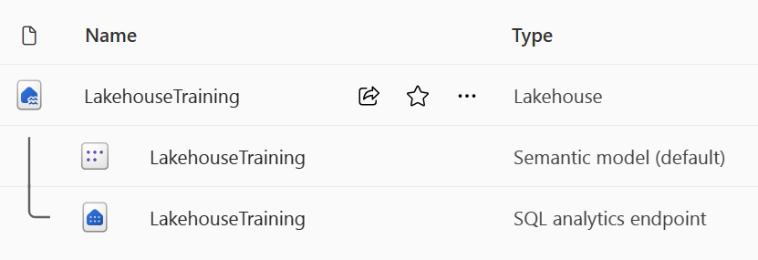

- [Module](https://learn.microsoft.com/en-gb/training/modules/get-started-lakehouses/)
- [Badge](https://learn.microsoft.com/api/achievements/share/en-gb/taniomi/4LM6ECCK?sharingId=BF42B601A1EE754B)
- # Introduction
	- The foundation of Microsoft Fabric is a **lakehouse**, which is built on top of the **OneLake** scalable storage layer and uses Apache Spark and SQL compute engines for big data processing. A lakehouse is a unified platform that 
	  combines:
		- The flexible and scalable storage of a data *lake*
		- The ability to query and analyze data of a data ware*house*
	- > What's the difference between a data: lakehouse, lake and warehouse?
- # Explore the Microsoft Fabric lakehouse
	- A **lakehouse** is a database built on top of a **data lake** using Delta format tables.
	- > What are Delta format tables? Why would I use them?
	- Lakehouses combine:
		- SQL-based analytical capabilities of a relational **data warehouse**
		- Flexibility and scalability of a **data lake**
		- {:height 299, :width 718}
	- Lakehouses store all data formats and can be used with various analytics tools and programming languages. As cloud-based solutions, lakehouses can scale automatically and provide high availability and disaster recovery.
	- Benefits of a lakehouse include:
		- Use of Spark and SQL engines to process large-scale data and support machine learning or predictive modeling analytics.
		- Lakehouse data is organized in a *schema-on-read format*, which means you define the schema as needed rather than having a predefined schema.
		- ACID support (Atomicity, Consistency, Isolation, Durability) transactions through Delta Lake formatted tables for data consistency and integrity.
		- Lakehouses are a single location for data engineers, data scientists, and data analysts to access and use data.
	- id:: 67bc9e74-378a-4575-bca3-b706c55641ad
	  > How can ACID help when working with data?
- ## Load data into a lakehouse
	- Possible data sources:
		- files
		- databases
		- APIs
		- external sources (as shortcuts): the data is kept in the external storage
		- basically you can use almost anything as a source
	- Use Apache Spark or Dataflows Gen2 to transform and load ingested data.
	- Use ADF pipelines to orchestrate ETL activities
- ## Secure a lakehouse
	- Grant access to workspace or to a specific item.
- # Work with Microsoft Fabric lakehouses
- ## Create and explore a lakehouse
	- After creating a lakehouse:
		- **lakehouse:** shortcuts, folders, files, tables
		- **Semantic model (default):** data source for PowerBI devs
		- **SQL analytics endpoint:** read-only access with SQL queries
		  id:: 67bca2a5-7526-443a-9ecd-17c96b84ce55
	- 
	- 
- ## Ingest data into a lakehouse
	- Methods to ingest data:
		- **Upload**: Upload local files.
		- **Dataflows Gen2**: Import and transform data using Power Query.
		- **Notebooks**: Use Apache Spark to ingest, transform, and load data.
		- **Data Factory pipelines**: Use the Copy data activity.
		- **Spark job definitions**: Is is possible to apply transformations and customize the behavior of the job through code libs and command line arguments.
		  id:: 67bca348-b733-46c0-b0af-da369bf30fcb
- # Explore and transform data in a lakehouse
- ## Transform and load data
	- **Notebooks** are favored by data engineers familiar with different programming languages including PySpark, SQL, and Scala.
	- **Dataflows Gen2** are excellent for developers familiar with Power BI or Excel since they use the PowerQuery interface.
	- **Pipelines** provide a visual interface to perform and orchestrate ETL 
	  processes. Pipelines can be as simple or as complex as you need.
- ## Analyze and visualize data in a lakehouse
	- Data scientists can use **notebooks or Data wrangler** to explore and train machine learning models for AI.
	- Report developers can use the **semantic model** to create Power BI reports.
	- Analysts can use the **SQL analytics endpoint** to query, filter, aggregate, and otherwise explore data in lakehouse tables.
- # DONE Exercise - Create a Microsoft Fabric lakehouse
	- Não deu para fazer muita coisa porque não tenho uma licença do Microsoft Fabric e não consegui uma Free Trial do Fabric. Aparentemente, só do PowerBI.