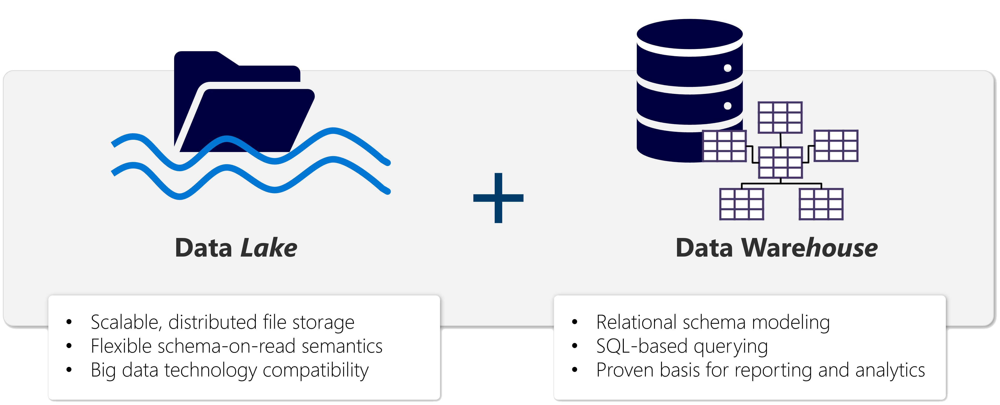

- [Module](https://learn.microsoft.com/en-gb/training/modules/get-started-lakehouses/)
- # Introduction
	- The foundation of Microsoft Fabric is a **lakehouse**, which is built on top of the **OneLake** scalable storage layer and uses Apache Spark and SQL compute engines for big data processing. A lakehouse is a unified platform that 
	  combines:
		- The flexible and scalable storage of a data *lake*
		- The ability to query and analyze data of a data ware*house*
	- > What's the difference between a data: lakehouse, lake and warehouse?
- # Explore the Microsoft Fabric lakehouse
	- A **lakehouse** is a database built on top of a **data lake** using Delta format tables.
	- > What are Delta format tables? Why would I use them?
	- Lakehouses combine:
		- SQL-based analytical capabilities of a relational **data warehouse**
		- Flexibility and scalability of a **data lake**
		- 
	- Lakehouses store all data formats
-