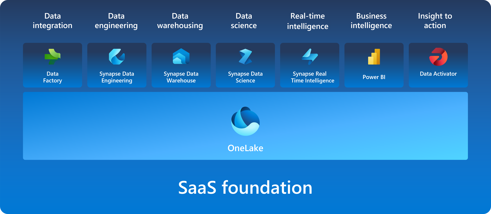
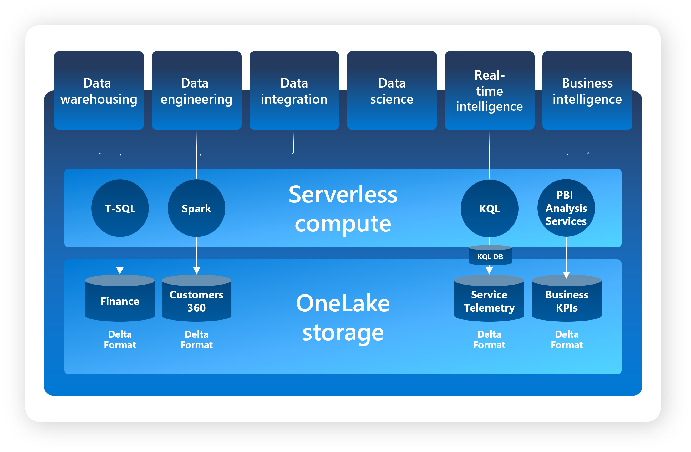

- [Module](https://learn.microsoft.com/en-gb/training/modules/introduction-end-analytics-use-microsoft-fabric/)
- [Badge](https://learn.microsoft.com/api/achievements/share/en-gb/taniomi/UYL58KA3?sharingId=BF42B601A1EE754B)
- # Introduction
	- Fabric includes the following services:
		- Data engineering
		- Data integration
		- Data warehousing
		- Real-time intelligence
		- Data science
		- Business intelligence
- # Explore end-to-end analytics with Microsoft Fabric
	- Fabric is a unified software-as-a-service (SaaS) offering, with all your data stored in a single open format in OneLake.
		- OneLake is accessible by all of the analytics engines in the platform.
		- Fabric offers scalability, cost-effectiveness, accessibility from anywhere with an internet connection, and continuous updates and maintenance provided by Microsoft.
- ## Explore OneLake
  id:: 67b79bcf-cef6-426a-b8c7-480380ea43d6
	- Like OneDrive for data.
	- OneCopy is a key component of OneLake that allows you to read data from a single copy, without moving or duplicating data.
		- 
	- OneLake is built on top of *Azure DataLake Storage (ADLS)*
		- 
- ## Explore Fabric's Experiences
	- Synapse Data Engineering: data engineering with a Spark platform for data transformation at scale.
		- Synapse Data Warehouse: data warehousing with industry-leading SQL performance and scale to support data use.
		- Synapse Data Science: data science with Azure Machine Learning and Spark for model training and execution tracking in a scalable environment.
		- Synapse Real-Time Intelligence: real-time intelligence to query and analyze large volumes of data in real-time.
		- Data Factory: data integration combining Power Query with the scale of Azure Data Factory to move and transform data.
		- Power BI: business intelligence for translating data to decisions through interactive reports.
- ## Explore workspaces
	- In Microsoft Fabric, workspaces serve as logical containers that help you organize and manage your data, reports, and other assets. They provide a clear separation of resources, making it easier to control access and maintain security.
	- Each workspace can have its own set of permissions, ensuring that only authorized users can view or modify the contents.
	- Settings to manage compute resources and integrate with Git for version control.
		- Features like data lineage and impact analysis, providing a comprehensive view of data flow and dependencies.
- ## Explore security and governance
	- The *admin center* centralizes Fabric administration.
	- Manage groups and permissions
	- Configure data sources and gateways
	- Monitor usage and performance
	- Access Fabric admin APIs and SDKs
- # Data teams and Microsoft Fabric
- ## Evolution of collaborative workflows
  id:: 67b79bcf-a380-4e79-a68a-4bd25ae86bc9
	- Microsoft Fabric transforms the analytics development process by unifying tools into a SaaS platform, allowing flexibility for different roles to perform necessary skills without duplicate work.
	- **Data engineers** can now ingest, transform, and load large amounts of data into OneLake and present it in whichever data store makes most sense. Data loading patterns are simplified using pipelines and architectures, such as medallion, can be easily configured using workspaces.
	- **Data analysts** gain greater context and streamline processes, transforming data upstream with Data Factory and connecting with data more directly using DirectLake mode.
	- **Data scientists** Integrate native data science techniques more easily and use Power BI's interactive reporting to provide data-informed insights.
	- **Analytics engineers** bridge the gap between data engineering and data analysis by curating data store assets, ensuring data quality, and enabling self-service analytics.
	- **Low-to-no-code users and citizen developers** can now discover curated data through the OneLake hub, and further process and analyze it to suit their needs without being dependent on data engineers or duplicating data.
- # Enable and use Microsoft Fabric
	- Permissions required to enable Fabric are either:
		- Fabric admin (formerly Power BI admin)
		- Power Platform admin
		- Microsoft 365 admin