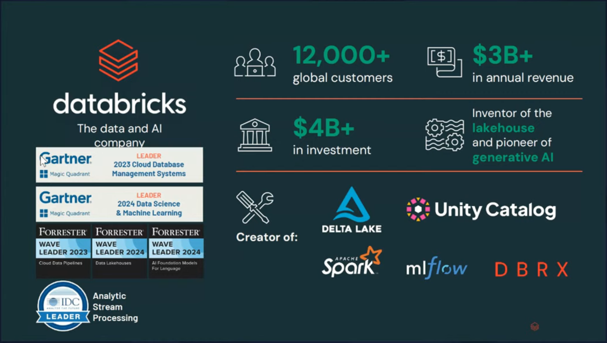
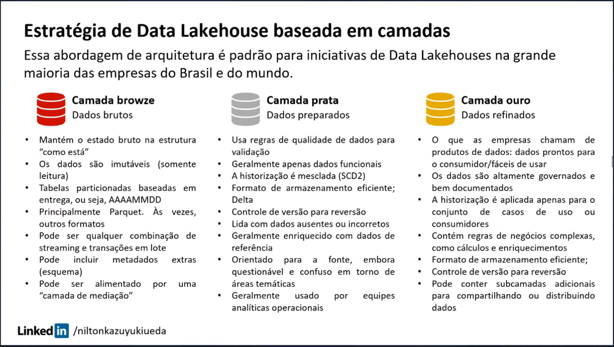

tags:: [[data-eng]], [[etl-elt]] , [[databricks]], [[jornada-dados]], [[live]]

- instructor:: [[luciano-galvao]], [[nilton-ueda]]
- Link da live[^1]
  id:: 67ac07a4-3132-4494-a7e4-950ea9a16818
- O dashboard é a ponta do iceberg e é muito importante ter os **fundamentos**.
  collapsed:: true
	- 
	- 
- # Conceitos Básicos
	- ## ETL vs. ELT
		- ### ETL: Extract Transform Load
			- Perde a rastreabilidade do dado bruto
			- A origem do ETL tem raízes no custo do armazenamento no passado. Antes, o armazenamento era muito caro, portanto o Transform era para reduzir a quantidade de dados para dar Load.
		- Com o Databricks e outras ferramentas de Modern Data Architecture/Stack, favoreceram o ELT:
		- ### ELT: Extract Load Transform
			- Evita ter que fazer download dos dados de novo se houver algum problema depois da Transformação
	- 
	- ## Data Mesh[^1]
		- Criar ambientes exclusivos e dedicados para áreas diferentes
		- Escalabilidade, gerenciar acesso
		- *mesh*:
			- Any of the open spaces in a net or network; an interstice.
			- The cords, threads, or wires surrounding these spaces.
			- An openwork fabric or structure; a net or network.
			- To cause to work closely together; coordinate.
		- A network of data?
		- 
- # Architecture
	- 
	- Os pilares que sustentam a estrutura são *Security*, *Governance* e *Data in Motion*
	- *Analytics & AI* trazem valor ao usuário final
- # Platform Engineering
	- 
	- *Reusable components*: Por que fazer o mesmo trabalho em plataformas diferentes ao invés de compartilhar algo dentro da empresa?
		- Ganhar velocidade, eficiência operacional, produtividade
	- *Tools*: utilizar ferramentas padronizadas em toda a empresa (dificuldade de muitas ferramentas se conversarem)
	- *Platform Services*: já prover aquilo que os colaboradores vão precisar (pandas, python, etc.)
	- *Knowledge*: documentar os processos principais da empresa
		- Como usar o ambiente?
		- Como documentar?
- # Plataformas Modernas de Dados
	- Essas soluções de plataformas de dados *resolvem problemas para as empresas* e são capazes de prover a infraestrutura para desenvolver projetos de Machine Learning, GenAI, etc
		- Databricks
		- Snowflake
		- AWS
		- GCP
		- Cloudera
		- Azure
	- > Se nos especializarmos nessas plataformas do slide, vamos ter trabalho por um bom tempo
	- 
- > ==Como mostrar valor para a empresa?== Construir uma POC mostrando AS-IS e TO-BE
	- Feijão com arroz bem feitinho. Não precisa reinventar a roda
	- Mostrar o que é e o que pode ser
- # Databricks
	- ## Overview
		- 
		- *Delta Lake*: resolve problema de organização e particionamento de dados no datalake
		- *Spark*: principal motor de processamento de dados em larga escala
		- *Unity Catalog*: governança, data lineage
		- *ML Flow*: tracking e gerenciamento de modelos de AI
		- *DBRX*: projeto de LLM open-source
		- Databricks proposes to be a *Data Intelligence Platform* (Data Lakehouse + GenAI) to *democratize data and AI*
		- 
	- ## Data Intelligence Platform
		- 
		- Databricks comprou a Mosaic
		- 
- # Data Driven Company
	- 
- # Camadas de dados
	- Tem empresas que incluem uma camada para raw data.
	- 
	- 
	- ## Materialização das camadas
	- 
	- 
	- Camada bronze não faz sentido a área de negócio final ter acesso (dados sujos). Faz sentido ter acesso até a camada silver.
	- A "camada de mediação" seria uma camada de *staging* (stg)
	- Qual a forma mais indicada para compartilhar com a área de negócio a camada gold?
		- Um schema com permissão de acesso, leitura e manipulação (SELECT)
	- ==O star schema de um PBI ficaria na camada gold?==
		- Sim. Star schema, OBT (One Big Table), snowflake, tudo que é para ser lido, fica na camada gold.
- # Como gerar valor e fazer acontecer a mudança
	- 
	- ## Strategy - Assessment
		- Cenários de transição: o que pode ser nosso use case? O que precisa para iniciar a mudança?
	- ## Stage 1 - First landing zone
		- Qual o primeiro use case que vai gerar valor e impacto que podemos implementar?
	- ## Stage 4 - Critical Governance
		- Precisa da casa primeiro antes de colocar a casa em ordem.
- # Tecnologias para construção de produtos de dados
- 
- Tudo isso, um PO precisa pensar.
- # Hands-on
	- Criar conta no Databricks: [signup.databricks.com](signup.databricks.com)
	- ## General
		- Modo *serverless* no Databricks não precisa esperar o cluster ligar!
		- *Marketplace* só no enterprise
	- ## SQL
		- *SQL Editor* dá para salvar e *compartilhar* queries
		- *Genie* te permite escolher uma table e fazer perguntas
	- ## Data Engineering
		- *Data Ingestion*
	- # Machine Learning
		- *Playground* é basicamente uma interface de ChatGPT, é possível escolher entre alguns modelos.
		- *Experiments*: implementação, tracking dos modelos de ML
		- *Features*: variáveis dos modelos de ML e AI
		- *Models*: modelos disponíveis no Databricks
		- *Serving*: endpoints para expôr os dados para fora, uma API!
- # Streaming com Arquitetura Medalhão no Databricks
	- timestamp:: 02:55:00
	- ==Quando uma coluna é adicionada num datasource, como replicá-la para as camadas bronze, silver e gold automaticamente?==
		- *Schema evolution*: recurso do Delta, guarda os metadados da tabela e valida se as colunas existem ou não e pode propagar para as camadas
		- Você precisa dessa flexibilidade de schema? Cuidado para não propagar lixo, principalmente na camada gold.
	- ==Airflow pode ser usado como complemento com os jobs do Databricks?==
		- Sim, Databricks tem API, daí Databricks poderia ser uma plataforma de processamento e o Airflow fica como o orquestrador.
	- ==Cada camada do medalhão foi materializada com uma tabela mas daria para criar um schema propriamente dito?==
		- Sim, um schema para cada camada e seria possível organizar várias tabelas nesses schemas.
	- ==Falando em larga escala, cada notebook seria uma camada?==
		- Não, pode ser se for muito pequenho.
		- Cada notebook seria uma peça, uma tabela, e os notebooks seriam orquestrados por um Workflow.
	- ==Consigo fazer isso tudo em SQL?==
		- Sim, mas teria que usar o Delta Live Tables.
		- Ingestão não dá, mas transformação e processamento dá pra fazer com SQL
		- Python com pyspark é uma linguagem mais forte para ingestão
		- SQL seria mais forte em transformação, manipulação e processamento
	- # Forms para receber slides
		- 
- # Certificações Databricks
	- Participe dos eventos de LEARNING FESTIVAL para ganhar vouchers para certificação
- # Referências
  id:: 67abe6d1-be21-44db-b373-57566e21d315
	- [^1]: ([Lakehouse com Arquitetura Medalhão no Databricks feat. Nilton Ueda](https://www.youtube.com/live/WAwoJzq0WpU))
	- [^2]: ([Como criar do ZERO um Lakehouse | Abertura Data Mesh Nilton Ueda | AWS, duckdb, Taipy, dbt-core](https://www.youtube.com/live/O9q5owTOpMw?si=bh-Un5ydaQcSzdJo))
	- Tool para fazer lives, parecido com o OBS: https://streamyard.com/