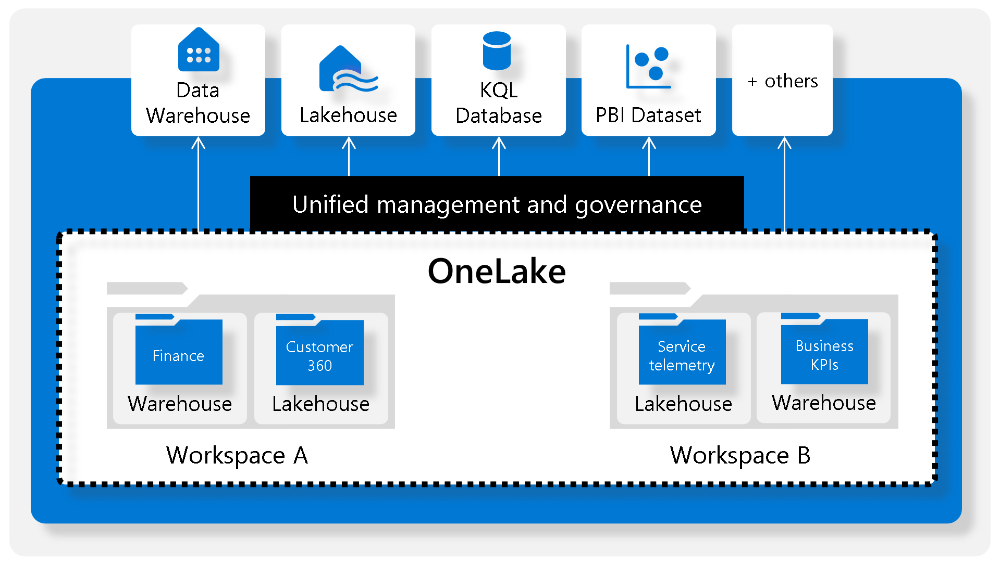
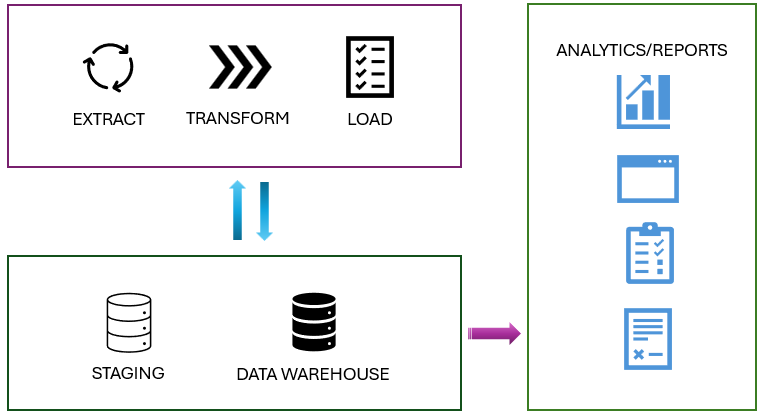
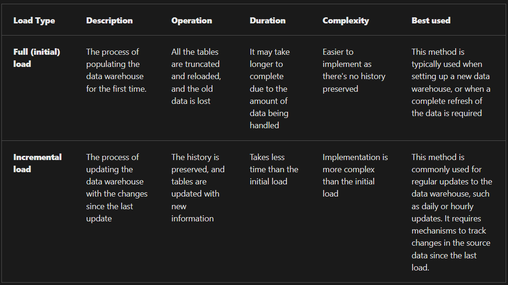
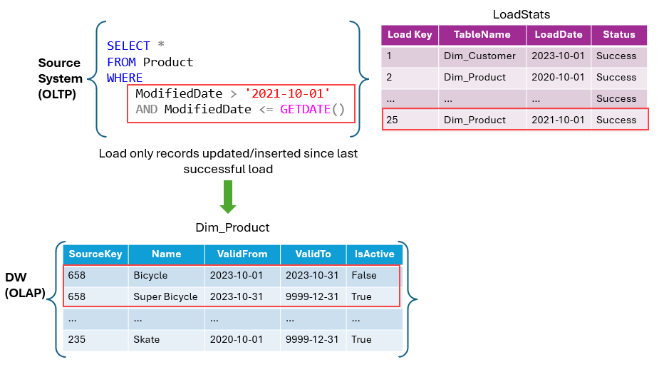

- [Module](https://learn.microsoft.com/en-us/training/modules/load-data-into-microsoft-fabric-data-warehouse/)
  :LOGBOOK:
  CLOCK: [2025-06-04 Wed 10:07:14]--[2025-06-04 Wed 10:07:14] =>  00:00:00
  :END:
- [Badge]()
- ## Learning objectives
	- Learn different strategies to load data into a data warehouse in Microsoft Fabric.
	- Learn how to build a data pipeline to load a warehouse in Microsoft Fabric.
	- Learn how to load data in a warehouse using T-SQL.
	- Learn how to load and transform data with dataflow (Gen 2).
- # Introduction
	- [Microsoft Fabric Data Warehouse](https://learn.microsoft.com/en-us/fabric/data-warehouse/) is a complete platform for data, analytics, and AI (Artificial Intelligence). It refers to the process of storing, organizing, and managing large volumes of structured and semi-structured data.
	- The data in the Microsoft Fabric warehouse is stored in the Parquet file format. This setup allows users to focus on tasks such as data preparation, analysis, and reporting. It takes advantage of the SQL engine’s extensive capabilities, where a unique copy of their data is stored in [Microsoft OneLake](https://learn.microsoft.com/en-us/fabric/onelake/onelake-overview).
	- 
- ## Understand the ETL (Extract, Transform, and Load) process
	- | Step | Description|
	  |-|-|
	  | Data extraction | It involves connecting to the source system and collecting necessary data for analytical processing. |
	  | Data transformation | It involves a series of steps performed on the extracted data to convert it into a standard format. Combining data from different tables, cleaning data, deduplicating data, and performing data validations.|
	  | Data loading | The extracted and transformed data are loaded into the fact and dimension tables. For an incremental load, this involves periodically applying ongoing changes as per requirement. This process often involves reformatting the data to ensure its quality and compatibility with the data warehouse schema.  |
	  | Post-load optimizations | Once the data is loaded, certain optimizations can be performed to enhance the performance of the data warehouse.|
- # Explore data load strategies
- ## Understand data ingestion and data load operations
	- **Data ingestion/extract** is about moving raw data from various sources into a central repository.
	- **Data loading** involves taking the transformed or processed data and loading it into the final storage destination for analysis and reporting.
	- Fabric data warehouses and lakehouses automatically store their data in OneLake using the Delta Parquet format.
- ## Stage your data
	- You might have to build and work with auxiliary objects involved in a load operation, such as tables, stored procedures, and functions. These auxiliary objects are commonly known as **staging**.
	- Staging objects act as temp storage and transformation areas.
	- They can either share resources with a data warehouse or reside in their own storage area.
	- Staging serves as an abstraction layer, simplifying and facilitating the load operation to the final tables in the data warehouse.
	- Staging area provides a buffer that can help to minimize the impact of the load operation on the performance of the data warehouse. This is important in environments where the data warehouse needs to remain operational and responsive during the data loading process.
	- 
- ## Review type of data loads
	- 
- ## Understand business key and surrogate key
	- **Surrogate key:** A surrogate key is a system-generated identifier that is used to uniquely identify a record in a table within the data warehouse. It has no business meaning and is typically an integer or a unique identifier. Surrogate keys are used to maintain consistency and accuracy in the data warehouse, especially when integrating data from multiple sources. They help to avoid issues that can arise from changes in the source systems, such as reusing or changing business keys.
	- **Business Key:** A business key, also known as a natural key, is an identifier that comes from the source system and has business meaning. It's used to uniquely identify a record in the source system. Examples of business keys include product codes, customer IDs, and employee numbers. Business keys are important for maintaining traceability between the data warehouse and the source systems. They help to ensure that data in the warehouse can be accurately matched to the corresponding records in the source systems.
- ## Load a dimension table
- ### Slowly changing dimensions (SCD)
	- Slowly Changing Dimensions evolve over time, but at a slow pace and unpredictably. Take, for instance, a customer's address in a retail business. When a customer relocates, their address changes. If you overwrite the old address with the new one, you lose the historical data. However, if you need to analyze historical sales data, it's crucial to know where the customer lived at the time of each sale.
	- Types of SCD in a data warehouse (most common are type 1 and 2)
		- **Type 0 SCD:** The dimension attributes never change.
		- **Type 1 SCD**: Overwrites existing data, doesn't keep history.
		- **Type 2 SCD**: Adds new records for changes, keeps full history for a given natural key.
		- **Type 3 SCD:** History is added as a new column.
		- **Type 4 SCD**: A new dimension is added.
		- **Type 5 SCD**: When certain attributes of a large dimension change over time, but using type 2 isn't feasible due to the dimension’s large size.
		- **Type 6 SCD**: Combination of type 2 and type 3.
	- In type 2 SCD, when a new version of the same element is brought to the data warehouse, the old version is considered expired and the new one becomes active.
	- 
	- The mechanism for detecting changes in source systems is crucial for determining when records are inserted, updated, or deleted. [Change Data Capture (CDC)](https://learn.microsoft.com/en-us/sql/relational-databases/track-changes/about-change-data-capture-sql-server), [change tracking](https://learn.microsoft.com/en-us/sql/relational-databases/track-changes/about-change-tracking-sql-server), and [triggers](https://learn.microsoft.com/en-us/sql/relational-databases/triggers/dml-triggers) are all features available for managing data tracking in source systems such as SQL Server.
- ## Load a fact table
	- Typically, a standard data warehouse load operation involves loading fact tables after dimension tables. This ensures that the dimensions, which the facts reference, are already present in the data warehouse.
	- The staged fact data usually includes business keys for the related dimensions, so your loading logic must look up the corresponding surrogate keys. When dealing with slowly changing dimensions in the data warehouse, it's crucial to identify the appropriate version of the dimension record to ensure the correct surrogate key is used. This matches the event recorded in the fact table with the state of the dimension at the time the fact occurred.
	- In many cases, you can retrieve the latest "current" version of the dimension. However, sometimes you might need to find the correct dimension record based on DateTime columns that indicate the period of validity for each version of the dimension.
- # Use data pipelines to load a warehouse
	-