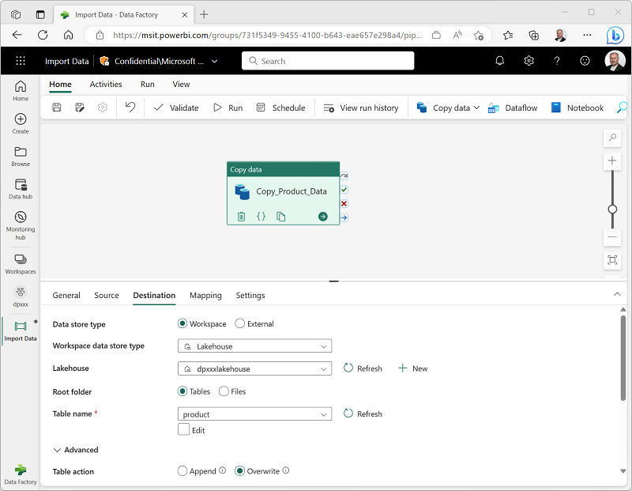

- [Module](https://learn.microsoft.com/en-gb/training/modules/use-data-factory-pipelines-fabric/)
- [Badge]()
- ## Learning objectives
	- In this module, you learn how to:
		- Describe pipeline capabilities in Microsoft Fabric.
		- Use the Copy Data activity in a pipeline.
		- Create pipelines based on predefined templates.
		- Run and monitor pipelines.
- # Introduction
	- **What is a data pipeline?** It is a sequence of activities that describe the overall process of extracting transactional data from a source, transforming it by performing operations, and loading it to an analytical data store, where it can be queried to perform statistical analysis, to build dashboards, etc. Usually ETL, sometimes ELT.
	- Familiarity with Azure Data Factory is a plus, because pipelines in Microsoft Fabric is basically the same.
- # Understand pipelines
- ## Core pipeline concepts
- ### Activities
  collapsed:: true
	- Activities are executable tasks in a pipeline.
	- A series of activities is a flow of activities.
	- The outcome of an activity (sucess, failure, completion) can define which activity is perfomed next, directing the flow.
	- There are two broad categories of activity in a pipeline.
		- **Data transformation activities** - activities that encapsulate data transfer operations, including simple **Copy Data** activities that extract data from a source and load it to a destination, and more complex **Data Flow** activities that encapsulate dataflows (Gen2) that apply transformations to the data as it is transferred. Other data transformation activities 
		  include **Notebook** (run a Spark notebook), **Stored procedure** (run SQL code), **Delete data**
		- **Control flow activities** - activities that implement the logic of the pipeline and direct the flow of activities. Used to implement loops, conditional branching, or manage variable and parameter values.
- ### Parameters
  collapsed:: true
	- Pipelines can be parameterized, so each time the pipeline runs, the parameters can have different values. Like doing a simple sum. Numbers **a** and **b** would be two parameters, but the operation performed is always the same: a sum.
- ### Pipeline runs
  collapsed:: true
	- Each time a pipeline is executed, a *data pipeline run* is initiated.
- # Use the Copy Data activity
  collapsed:: true
	- Copies data. Can connect to a wide variety of sources.
	- Need to configure source and sink.
- ## Copy Data activity settings
	- Pretty much just like ADF.
	- 
- ## When to use the Copy Data activity
  collapsed:: true
	- Use it to copy data directly between a supported source and destination without applying any transformations, or when you want to import the raw data and apply transformations in later pipeline activities (ELT).
	- If you need to apply transformations to the data as it is ingested, or merge data from multiple sources, consider using a **Data Flow** activity to run a dataflow (Gen2). You can use the Power Query user interface to define a dataflow (Gen2) that includes multiple transformation steps, and include it in a pipeline.
- # Use pipeline templates
	-