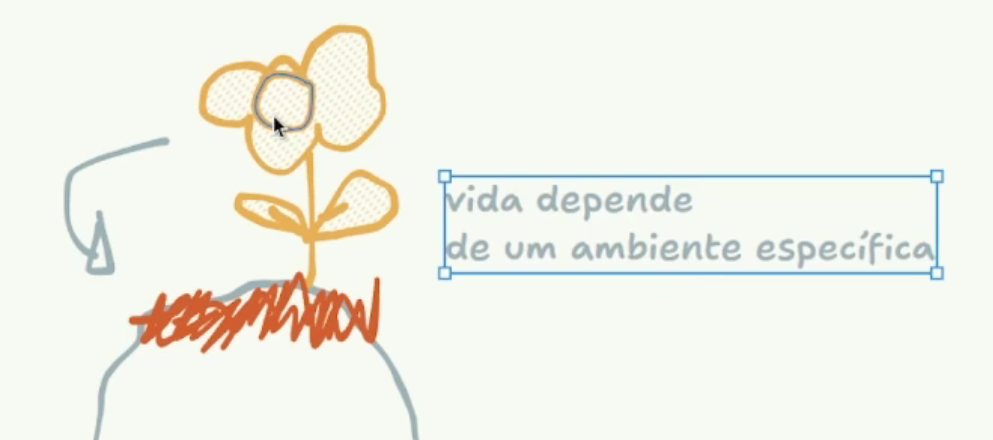

tags:: [[dio/docker]], [[data-eng]]

- instructor:: [[felipe-aguiar]]
- # Qual problema o Docker veio resolver?
	- Cada um desenvolvendo em um sistema operacional diferente, dependências diferentes, arquivos .dll diferentes.
	- 
	- Quando sobe para a cloud, o ambiente pode ser diferente também, uma distro do linux mais limpa por exemplo.
	- 
	- ## Como resolver o problema de dependências?
	- ### Antigamente
		- Servidores tinham uma VM em cima e daí rodavam a aplicação.
		- 
		- Desse jeito, custo da máquina era maior e causava perda de performance ainda. Além disso, quando fosse desenvolver, seria necessário criar uma VM para daí desenvolver em cima dela.
		- Mesmo com imagens mais "peladas" de SOs, era muito pesado e custoso. O Windows, por exemplo, sempre instala uma cacetada de coisas que não precisa e não dá para desinstalar. (cheio de *bloatware*)
- # Como o Docker soluciona o problema?
	- 
	- O que acontece se tentar tirar essa planta e levar ela para outro ambiente?
	- Planta morre ou não cresce do jeito que deveria.
	- Ah, então vamos levar a planta e a montanha junto! Mas como que eu vou mover uma montanha inteira pro meu quintal?
	- 
	- Solução: levar um pouco da terra num potinho, o mínimo para que ela sobreviva.
	- 
	- ## Fazendo a ligação com o software
		- A aplicação é a planta, a montanha é o ambiente, o potinho é o contâiner do Docker.
		- Tentar levar a montanha é tentar simular o sistema operacional inteiro com VM.
		- A solução é que o ambiente seja portátil, uma amostragem com o mínimo necessário para a aplicação rodar.
		- A logo do Docker é uma baleia que navega entre vários oceanos (SOs), levando os contâineres para rodar a aplicação.
	- ### Exemplo prático
		- Minha aplicação está rodando e tem muita requisição. Crio um contâiner e destino um contâiner somente para requisições do Brasil, o outro somente para requisições dos EUA.
		- Os dois contâineres podem estar ligados no mesmo banco de dados.
		- E os contâineres também podem conversar entre si.
		- 
- # References
	- Drawing tool: https://www.tldraw.com/