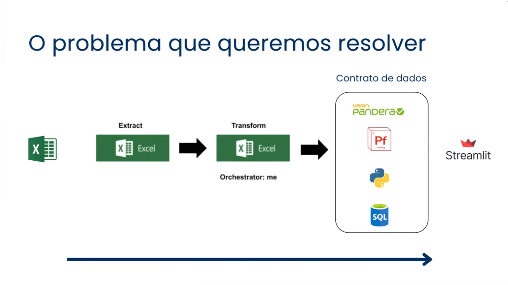
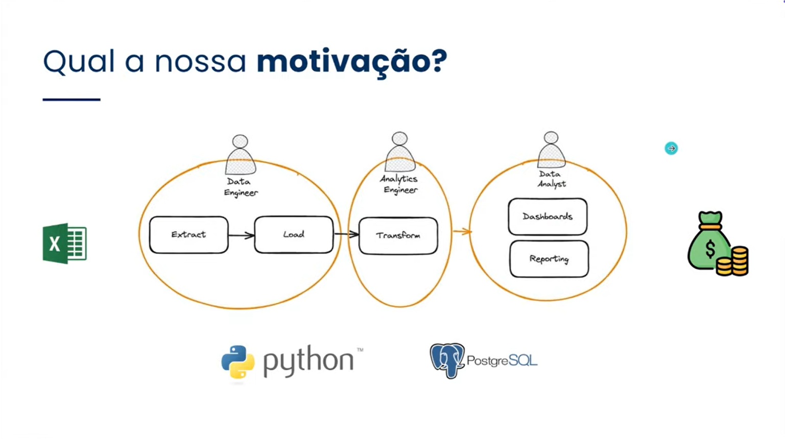
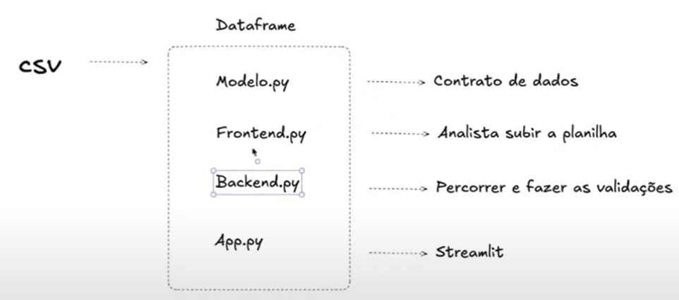

tags:: [[data-eng]], [[etl-elt]], [[jornada-dados]], [[live]]

- instructor:: [[luciano-galvao]], [[caio-machado]]
- **Link Live:** [YouTube](https://www.youtube.com/live/JuOyNPjAer8?si=fD3Z6MDfACAWlh3G)
- **Tech:** pydantic, pandera, python, SQL
- **Meu repo GitHub:** [etl-python-excel](https://github.com/taniomi/etl-python-excel)
- # Introdução
- ## Explicando o projeto e o desafio
	- **O problema:** criar um *contrato de dados* agnóstico, que independe do output (locker, streamlit, powerbi, etc.)
	- 
- ## Qual é a nossa motivação?
	- **A motivação:** capacitar analistas, porque engenharia de dados dá mais dinheiro e proporcionaria qualidade de vida melhor
	- 
- # Projeto
- ## Planejando as etapas do projeto
	- 
- ## Análise exploratória (Pandas Profiling)
	- Instalar *ydata-profiling*
	- `/src/profiling.py`
- ## Validação de dados
- ### Explicando as libs Pydantic e Pandera
	- *pandera:* valida o dataset inteiro
	- *pydantic:* valida cada linha como se fosse um objeto
	- Vamos utilizar o *pydantic*
	- No *pydantic*, definimos quais colunas e quais tipos de dados esperamos para cada uma (como um dict dtypes!)
- ## Criando o contrato de dados + script para leitura e transformação de CSV
	- > O quão escalável é o *pydantic*?
	  
	  O *pydantic* e o *pandera* são Open Source, e muito utilizados, então não precisa reinventar a roda.
	- Estude os modelos de validação de dados na documentação do *pydantic*, lá já deve ter exatamente o que você precisa!
	- Estrutura básica do projeto
	  {:height 339, :width 748}