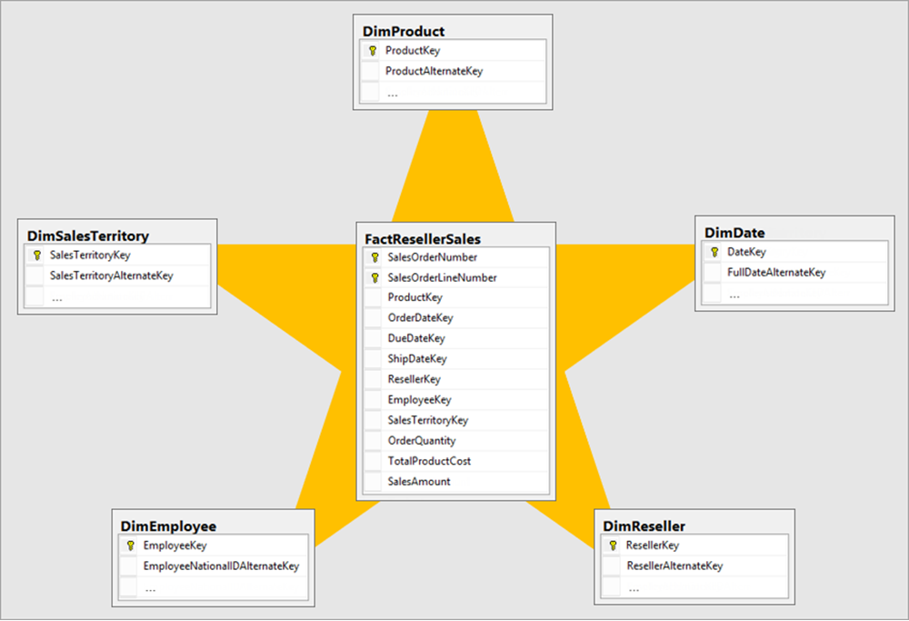

- [Module](https://learn.microsoft.com/en-us/training/modules/query-data-warehouse-microsoft-fabric/)
- [Badge](https://learn.microsoft.com/api/achievements/share/en-us/taniomi/W2DMPT2N?sharingId=BF42B601A1EE754B)
- ## Learning objectives
	- Use SQL query editor to query a data warehouse.
	- Explore how visual query editor works.
	- Learn how to connect and query a data warehouse using SQL Server Management Studio.
- # Introduction
	- [Microsoft Fabric Data Warehouse](https://learn.microsoft.com/en-us/fabric/data-warehouse/) is a complete platform for data, analytics, and AI (Artificial Intelligence). It refers to the process of storing, organizing, and managing large volumes of structured and semi-structured data.
	- Data warehouse in Microsoft Fabric is powered up with Synapse Analytics by offering a rich set of features that make it easier to manage and analyze data.
- ## Star schema design
	- In a typical data warehouse, the data is organized using a schema, often a [star schema](https://learn.microsoft.com/en-us/power-bi/guidance/star-schema) or a [snowflake schema](https://learn.microsoft.com/en-us/power-bi/guidance/star-schema#snowflake-dimensions?azure-portal=true).
	- The star schema and snowflake schema are mature modeling approaches widely adopted by relational data warehouses. It requires you to classify tables as either dimension or fact.
	- Fact tables store the measurable, quantitative data about a business, while dimension tables contain descriptive attributes related to fact data.
	- 
- # Query data
- ## Using ranking functions
	- **ROW_NUMBER** returns the ordinal position of the row within the partition. For example, the first row is numbered 1, the second 2, and so on.
	- **RANK** returns the ranked position of each row in the ordered results. For example, in a partition of stores ordered by sales volume, the store with the highest sales volume is ranked 1. If multiple stores have the same sales volumes, they'll be ranked the same, and the rank assigned to subsequent stores reflects the number of stores that have higher sales volumes - including ties.
	- **DENSE_RANK** ranks rows in a partition the same way as **RANK**, but when multiple rows have the same rank, subsequent rows ranking positions ignore ties.
	- **NTILE** returns the specified percentile in which the row falls. For example, in a partition of stores ordered by sales volume, `NTILE(4)` returns the quartile in which a store's sales volume places it.
- ## Retrieving an approximate count
	- When dealing with very large amounts of data, it might be acceptable to get approximate results. We gain time by using `APPROX_COUNT_DISTINCT`.
	  id:: 6851a32b-c769-47e9-9b73-1cd52b39fc81
	- The `APPROX_COUNT_DISTINCT` function uses a *HyperLogLog* algorithm to retrieve an approximate count. The result is guaranteed to have a maximum error rate of 2% with 97% probability.
	- ```sql
	  SELECT dates.CalendarYear AS CalendarYear,
	      APPROX_COUNT_DISTINCT(sales.OrderNumber) AS ApproxOrders
	  FROM FactSales AS sales
	  JOIN DimDate AS dates ON sales.OrderDateKey = dates.DateKey
	  GROUP BY dates.CalendarYear
	  ORDER BY CalendarYear;
	  ```
- # Use client tools to query a warehouse
	- Use SQL Server Management Studio (SSMS) to connect to a Fabric data warehouse.
- ## Authentication options
	- Microsoft Entra ID (formerly Azure Active Directory) user principals, or user identities
	- Microsoft Entra ID (formerly Azure Active Directory) service principals
- ## Other tools
	- Any third-party tool can use the SQL connection string via ODBC or OLE 
	  DB drivers to connect to a Microsoft Fabric Warehouse or SQL analytics 
	  endpoint, using Microsoft Entra ID (formerly Azure Active Directory) 
	  authentication.