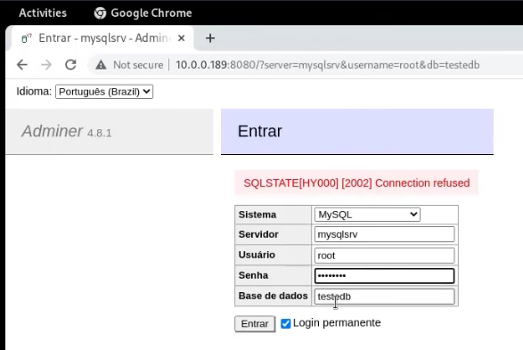

tags:: [[dio/docker]], [[data-eng]]

- instructor:: [[denilson-bonatti]]
- # Intro e instalação do Docker Compose
	- Docker Compose usa arquivo YAML para definir os serviços e facilitar a subida de vários containers com um único arquivo.
- # Docker compose exemplo prático
	- ```bash
	  # root docker
	  cd /data/
	  mkdir mysql-C  # criando dir para persistir os dados
	  cd ..
	  mkdir /compose
	  cd compose/
	  mkdir primeiro
	  cd primeiro/
	  nvim touch docker-compose.yml
	  ```
	- ```yaml
	  docker-compose.yml
	  ====================
	  
	  version: '3.8'
	  
	  services:
	    mysqlsrv:  # service 1
	      image: mysql:5.7
	      environment:
	        MYSQL_ROOT_PASSWORD: "Senha123"
	        MYSQL_DATABASE: "testedb"
	      ports:
	        - "3306:3306"
	      volumes:
	        - /data/mysql-C:/var/lib/mysql  # indicando onde persistir os dados
	      networks:
	        - minha-rede
	  
	    adminer:  # service 2
	      image: adminer
	      ports:
	        - 8080:8080
	      networks:
	        - minha-rede
	  
	  networks: 
	    minha-rede:
	      driver: bridge
	  ```
	- ```bash
	  docker-compose up -d
	  docker ps  # see if containers are running
	  ip a  # pick adminer ip and test it in a browser
	  ```
	- 
	- If it doesn't work, check log of the container and see if it's ready for connection.
- # docker compose down
	- Parar containers, excluir rede.
	- ```bash
	  docker-compose down
	  ```
- -> DIfference between docker compose and docker-compose? [^1]
  background-color:: yellow
	- The `docker compose` (with a space) is a newer project to migrate compose to Go with the rest of the docker project. This is the `v2` branch of the [docker/compose](https://github.com/docker/compose/tree/v2) repo. It's been first introduced to Docker Desktop users, so docker users on Linux didn't see the command. In addition to migrating to Go, it uses the compose-spec, and part of the rewrite may result in behavior differences.
	- The original python project, called `docker-compose`, aka v1 of docker/compose repo, has now been deprecated and development has moved over to v2. To install the v2 `docker compose` as a CLI plugin on Linux, supported distribution can now install the `docker-compose-plugin` package. E.g. on debian, I run `apt-get install docker-compose-plugin`.
- # Exemplo PHP Apache MySQL
	- ## Arquivo yaml
		- ```yml
		  ===============================================
		  docker-compose.yml
		  ===============================================
		  
		  version: "3.7"
		  
		  services:
		    web:
		      image: webdevops/php-apache:alpine-php7
		      ports:
		        - "4500:80"
		      volumes:
		        - /data/php/:/app
		  
		      networks:
		        - minha-rede
		  
		    db:  # nome do bd!
		      image: mysql:5.7
		      environment:
		        MYSQL_ROOT_PASSWORD: "Senha123"
		        MYSQL_DATABASE: "testedb"
		      ports:
		        - "3306:3306"
		      volumes:
		        - /data/mysql-C:/var/lib/mysql
		  
		      networks:
		        - minha-rede
		  
		    phpmyadmin:  # gerenciador de bd
		      image: phpmyadmin/phpmyadmin
		      environment:
		        MYSQL_ROOT_PASSWORD: "Senha123"
		      ports:
		        - "8080:80"
		      volumes:  # especificando arquivo de configuração
		        - /data/php/admin/uploads.ini:/usr/local/etc/php/conf.d/php-phpmyadmin.ini
		  
		      networks:
		        - minha-rede
		  
		  networks:
		     minha-rede:
		       driver: bridge
		  ```
	- ## Arquivo de config
		- ```ini
		  =============================================================
		   uploads.ini
		  =============================================================
		   
		  file_uploads = On
		  memory_limit = 500M
		  upload_max_filesize = 500M
		  post_max_size = 500M
		  max_execution_time = 600
		  max_file_uploads = 50000
		  max_execution_time = 5000
		  max_input_time = 5000
		  ```
	- ## Arquivo php
		- ```php
		  =============================================================
		  index.php
		  =============================================================
		  <html>
		  
		  <head>
		  <title>Exemplo PHP</title>
		  </head>
		  
		  
		  <?php
		  ini_set("display_errors", 1);
		  header('Content-Type: text/html; charset=iso-8859-1');
		  
		  
		  
		  echo 'Versao Atual do PHP: ' . phpversion() . '<br>';
		  
		  $servername = "db";
		  $username = "root";
		  $password = "Senha123";
		  $database = "testedb";
		  
		  // Criar conexão
		  
		  
		  $link = new mysqli($servername, $username, $password, $database);
		  
		  /* check connection */
		  if (mysqli_connect_errno()) {
		      printf("Connect failed: %s\n", mysqli_connect_error());
		      exit();
		  }
		  
		  $query = "SELECT * FROM tabela_exemplo";
		  
		  if ($result = mysqli_query($link, $query)) {
		  
		      
		      while ($row = mysqli_fetch_assoc($result)) {
		          printf ("%s %s %s <br>", $row["nome"], $row["cidade"], $row["salario"]);
		      }
		  
		      
		      mysqli_free_result($result);
		  }
		  
		  
		  mysqli_close($link);
		  
		  ?>
		  
		  </html>
		  ```
- # Utilizando exemplos do GitHub do Docker [^2]
- # Referências
	- [^1]: https://stackoverflow.com/a/66516826/23164295
	- [^2]: https://github.com/docker/awesome-compose