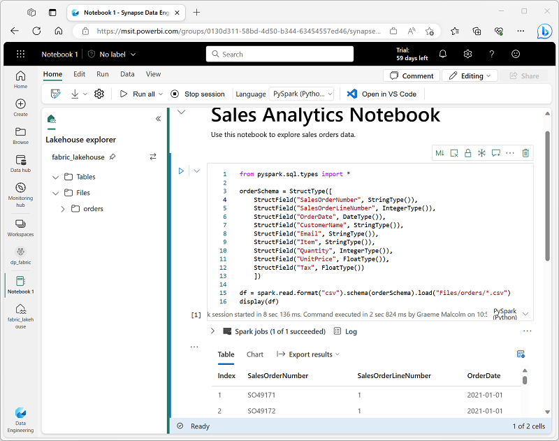
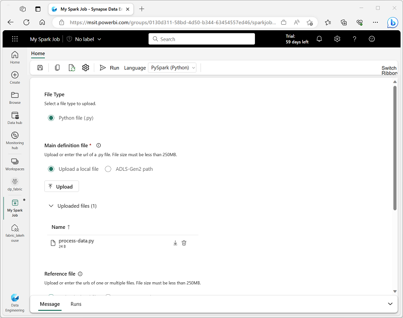
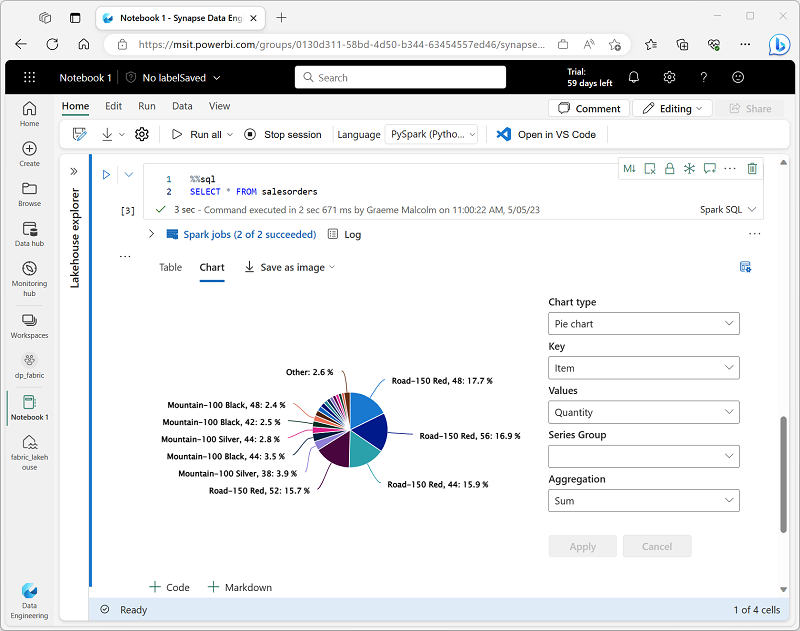

- [Module](https://learn.microsoft.com/en-gb/training/modules/use-apache-spark-work-files-lakehouse/)
- [Badge](https://learn.microsoft.com/api/achievements/share/en-gb/taniomi/XMNCTVXY?sharingId=BF42B601A1EE754B)
- # Introduction
	- > What IS Apache Spark?
		- **Apache Spark** is a free, open-source tool designed to handle **big data**. It’s built to process this data quickly and efficiently.
		- **"Parallel processing framework"** means Spark can split a big job into smaller tasks and work on them all at the same time, using multiple computers or processors.
		- Spark uses a "divide and conquer" approach to processing large volumes of data quickly by distributing the work across multiple computers. The process of distributing tasks and collating results is handled for you by Spark.
		  id:: 67c0bff4-b0c3-4deb-be67-f40792081200
			- *Example:* Imagine you’re baking 100 cookies. Instead of making them one by one, you give 10 friends a tray each to bake 10 cookies at once. That’s parallel processing—it speeds things up.
		- **"Large-scale data processing and analytics"** refers to what Spark does with the data. It can:
		  id:: 67c0bda6-c7b0-49ca-a9a2-dae35ce35ab6
			- **Process**: Clean, organize, or transform huge datasets (e.g., sorting customer info from a million sales records).
			  id:: 67c0bd64-381a-4ed4-8da2-65ebcaa1a68b
			- **Analyze**: Dig into the data to find patterns or insights (e.g., figuring out which products sell best in certain regions).
	- **The goal of this module:**
		- How you can use Spark in Microsoft Fabric to ingest, process, and analyze data in a lakehouse.
- # Prepare to use Apache Spark
- Apache is able to process large-scale data by dividing the work across multiple nodes in a cluster (a *Spark pools* in MS Fabric).
- ## Spark pools
- *Spark pools* is a fancy name for the nodes of a cluster.
- The nodes of a cluster are the workers and have tasks divided between them by the head cluster.
- One cluster is dedicated to managing and distributing tasks and the others are responsible for executing the tasks.
- A *head* node in a Spark pool coordinates distributed processes through a *driver* program.
  logseq.order-list-type:: number
- The pool includes multiple *worker* nodes on which *executor* processes perform the actual data processing tasks.
  logseq.order-list-type:: number
- 
- 
- ### Spark pools in Microsoft Fabric
	- Specific configuration settings for Spark pools include:
	- **Node Family**: The type of virtual machines used for the Spark cluster nodes. In most cases, *memory optimized* nodes provide optimal performance.
	- **Autoscale**: Whether or not to automatically 
	  provision nodes as needed, and if so, the initial and maximum number of 
	  nodes to be allocated to the pool.
	- **Dynamic allocation**: Whether or not to dynamically allocate *executor* processes on the worker nodes based on data volumes
- ## Runtimes and environments
	- *Spark runtime* refers to the specific environment or setup that runs Apache Spark. Like the engine under the hood of a car—it’s the core system that powers everything.
	- *Spark runtime* is like a pre-packaged toolkit that contains Apache Spark, Delta Lake, Python and other software with compatible versions. We're locking in the versions, just like with a lock file, so that everything works together!
- ### Environments in Microsoft Fabric
	- When creating a custom environment, you can:
	  id:: 67c0c7e7-3442-4c12-9cca-ad96063abc5d
		- Specify the Spark runtime it should use.
		- View the built-in libraries that are installed in every environment.
		- Install specific public libraries from the Python Package Index (PyPI).
		- Install custom libraries by uploading a package file.
		- Specify the Spark pool that the environment should use.
		- Specify Spark configuration properties to override default behavior.
		- Upload resource files that need to be available in the environment.
- ## Additional Spark configuration options
	- Spark pools and environments are the primary configs for Spark processing in a Fabric workspace. Other options for optimizations are:
- ### Native execution engine
	- **What?** Vectorized processing engine that runs Spark operation directly ON the lakehouse infrastructure.
	- **Why?** Improve performance of queries when using large data sets in Parquet or Delta file formats.
	- **How?** Enable native execution engine on the *environment* or in an *individual notebook*.
		- Environment configs:
		  ```
		  spark.native.enabled: true
		  spark.shuffle.manager: org.apache.spark.shuffle.sort.ColumnarShuffleManager
		  ```
		- Notebook configs at the beginning of code:
		  ```
		  %%configure 
		  { 
		     "conf": {
		         "spark.native.enabled": "true", 
		         "spark.shuffle.manager": "org.apache.spark.shuffle.sort.ColumnarShuffleManager" 
		     } 
		  }
		  ```
- ### High concurrency mode
	- **What?** Multiple concurrent users or processes share the same Spark session.
	- **Why?** Optimize efficiency of Spark resource usage.
	- **How?** Enable high concurrency mode in *notebooks* or *Spark jobs*.
		- To enable high concurrency mode, use the **Data Engineering/Science** section of the workspace settings interface.
- ### Automatic MLFlow logging
	- **What?** MLFlow is an open source library. Automatic MLFlow logging is a feature that logs important info in ML experiments.
	- **Why?** It saves the time of doing the work of writing code for logging experiment details (hyperparameters, performance metrics, model architecture, weights, etc.)
	- **How?** Enabled by default. Disable in wokspace settings.
- ### Spark administration for a Fabric capacity
	- Administrators can manage Spark settings at a Fabric capacity level, 
	  enabling them to restrict and override Spark settings in workspaces 
	  within an organization.
- # Run Spark code
	- Use a *notebook* or define a *Spark job*.
- ## Notebooks
	- 
- ## Spark job definition
	- Just like Databricks jobs.
	- 
- # Work with data in a Spark dataframe
	- Natively, Spark uses a data structure called a *resilient distributed dataset* (RDD); but while you *can* write code that works directly with RDDs, the most commonly used data structure for working with structured data in Spark is the *dataframe*, which is provided as part of the *Spark SQL* library.
	- Dataframes in Spark are similar to those in the ubiquitous *Pandas* Python library, but optimized to work in Spark's distributed processing environment.
- ## Loading data into a dataframe
- ### Inferring a schema
	- Load data from a .csv file and display the first 10 rows.
	  id:: 67d0bf35-9ef4-4c0c-8987-4cd16e0b7dd7
	- Spark willl *infer* the data type of each column from the data.
	- ```python
	  %%pyspark
	  df = spark.read.load('Files/data/products.csv',
	      format='csv',
	      header=True
	  )
	  display(df.limit(10))
	  ```
	- ```scala
	  %%spark
	  val df = spark.read.format("csv").option("header", "true").load("Files/data/products.csv")
	  display(df.limit(10))
	  ```
- ### Specifying an explicit schema
	- *Explicitly* define the schema of the data being consumed.
	- ```python
	  from pyspark.sql.types import *
	  from pyspark.sql.functions import *
	  
	  productSchema = StructType([
	      StructField("ProductID", IntegerType()),
	      StructField("ProductName", StringType()),
	      StructField("Category", StringType()),
	      StructField("ListPrice", FloatType())
	      ])
	  
	  df = spark.read.load('Files/data/product-data.csv',
	      format='csv',
	      schema=productSchema,
	      header=False)
	  display(df.limit(10))
	  ```
- ## Filtering and grouping dataframes
	- ```python
	  pricelist_df = df.select("ProductID", "ListPrice")
	  pricelist_df = df["ProductID", "ListPrice"]
	  ```
	- **select** returns a new dataframe object.
	- Method chaining is possible:
	- ```python
	  bikes_df = df.select("ProductName", "Category", "ListPrice").where((df["Category"]=="Mountain Bikes") | (df["Category"]=="Road Bikes"))
	  display(bikes_df)
	  ```
	- **groupBy**
	- ```python
	  counts_df = df.select("ProductID", "Category").groupBy("Category").count()
	  display(counts_df)
	  ```
- ## Saving a dataframe
	- ```python
	  bikes_df.write.mode("overwrite").parquet('Files/product_data/bikes.parquet')
	  ```
	- Parquet format is preferred for data files that you will use for further analysis or ingestion into an analytical store.
	- Sometimes your data transformation requirement may simply be to convert data from another format (such as CSV) to Parquet!
- ### Partitioning the output file
	- To save a dataframe as a partitioned set of files, use the **partitionBy** method when writing the data. The following example saves the **bikes_df** dataframe (which contains the product data for the *mountain bikes* and *road bikes* categories), and partitions the data by category:
	- ```python
	  bikes_df.write.partitionBy("Category").mode("overwrite").parquet("Files/bike_data")
	  ```
	- The folder names generated when partitioning a dataframe include the partitioning column name and value in a **column=value** format, so the code example creates a folder named **bike_data** that contains the following subfolders:
		- ```nginx
		  bike_data
		  ├─ Category=Mountain Bikes
		  └─ Category=Road Bikes
		  ```
	- Each subfolder contains one or more parquet files with the product data for the appropriate category.
	- It is possible to partition by multiple columns, creating a hierarchy of folders. E.g.: partition sales order data by year and month
	  ```nginx
	  sales_orders
	  ├─ 2023
	  │  ├─ 01
	  │  ├─ 02
	  │  ├─ 03
	  │  └─ ...
	  ├─ 2024
	  │  ├─ 01
	  │  ├─ 02
	  │  ├─ 03
	  │  └─ ...
	  └─ 2025
	     ├─ 01
	     ├─ 02
	     ├─ 03
	     └─ ...
	  ```
- ## Load partitioned data
	- ```python
	  road_bikes_df = spark.read.parquet('Files/bike_data/Category=Road Bikes')
	  display(road_bikes_df.limit(5))
	  ```
- # Work with data using Spark SQL
	- The Dataframe API is part of a Spark library named Spark SQL, which enables data analysts to use SQL expressions to query and manipulate data.
- ## Creating database objects in the Spark catalog
	- **Spark catalog:** a metastore for relational data objects such as views and tables.
	- Create a temporary view (deleted at the end of the current session):
	  ```python
	  df.createOrReplaceTempView("products_view")
	  ```
	- Microsoft Fabric *Managed tables* VS *Spark created tables*
		- Managed tables have data stored in the tables storage location in the data lake
		- Tables created through Spark are listed in the tables storage location.
	- You can create an empty table by using the `spark.catalog.createTable` method, or you can save a dataframe as a table by using its `saveAsTable` method. Deleting a managed table also deletes its underlying data.
	- Create table named products:
	  ```python
	  df.write.format("delta").saveAsTable("products")
	  ```
	- You can create *external* tables by using the `spark.catalog.createExternalTable` method. External tables define metadata in the catalog but get their underlying data from an external storage location; typically a folder in the **Files** storage area of a lakehouse. Deleting an external table doesn't delete the underlying data.
	- It is possible to partition tables just like parquet files, and we can achieve better performance when querying them!
	  background-color:: green
- ## Using the Spark SQL API to query data
	- ```python
	  bikes_df = spark.sql("SELECT ProductID, ProductName, ListPrice \
	                        FROM products \
	                        WHERE Category IN ('Mountain Bikes', 'Road Bikes')")
	  display(bikes_df)
	  ```
- ## Using SQL code
	- Add `%%sql` to the beginning of a notebook cell to use sql in it.
	- ```sql
	  %%sql
	  
	  SELECT Category, COUNT(ProductID) AS ProductCount
	  FROM products
	  GROUP BY Category
	  ORDER BY Category
	  ```
- # Visualize data in a Spark notebook
	- Microsoft Fabric's notebooks offer built-in charts, like Briefer.
- ## Using built-in notebook charts
	- 
- ## Using graphics packages in code
	- Use other python libs to create graphs, like matplotlib, seaborn, etc.
	- ```python
	  from matplotlib import pyplot as plt
	  
	  # Get the data as a Pandas dataframe
	  data = spark.sql("SELECT Category, COUNT(ProductID) AS ProductCount \
	                    FROM products \
	                    GROUP BY Category \
	                    ORDER BY Category").toPandas()
	  
	  # Clear the plot area
	  plt.clf()
	  
	  # Create a Figure
	  fig = plt.figure(figsize=(12,8))
	  
	  # Create a bar plot of product counts by category
	  plt.bar(x=data['Category'], height=data['ProductCount'], color='orange')
	  
	  # Customize the chart
	  plt.title('Product Counts by Category')
	  plt.xlabel('Category')
	  plt.ylabel('Products')
	  plt.grid(color='#95a5a6', linestyle='--', linewidth=2, axis='y', alpha=0.7)
	  plt.xticks(rotation=70)
	  
	  # Show the plot area
	  plt.show()
	  ```
	- 
- # Exercise - Analyze data with Apache Spark
	- [Launch Exercise](https://microsoftlearning.github.io/mslearn-fabric/Instructions/Labs/02-analyze-spark.html)
- # Resources
	- [Spark SQL, DataFrames and Datasets Guide](https://spark.apache.org/docs/latest/sql-programming-guide.html)