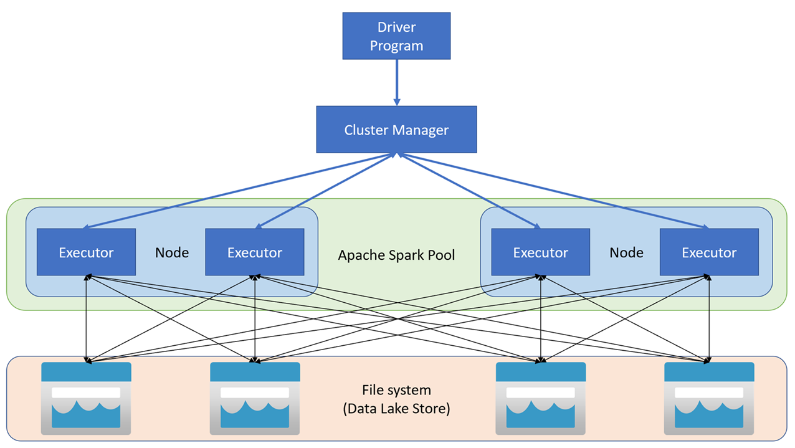

- [Module](https://learn.microsoft.com/en-gb/training/modules/use-apache-spark-work-files-lakehouse/)
- [Badge]()
- # Introduction
	- > What IS Apache Spark?
		- **Apache Spark** is a free, open-source tool designed to handle **big data**. It’s built to process this data quickly and efficiently.
		- **"Parallel processing framework"** means Spark can split a big job into smaller tasks and work on them all at the same time, using multiple computers or processors.
		- Spark uses a "divide and conquer" approach to processing large volumes of data quickly by distributing the work across multiple computers. The process of distributing tasks and collating results is handled for you by Spark.
		  id:: 67c0bff4-b0c3-4deb-be67-f40792081200
			- *Example:* Imagine you’re baking 100 cookies. Instead of making them one by one, you give 10 friends a tray each to bake 10 cookies at once. That’s parallel processing—it speeds things up.
		- **"Large-scale data processing and analytics"** refers to what Spark does with the data. It can:
		  id:: 67c0bda6-c7b0-49ca-a9a2-dae35ce35ab6
			- **Process**: Clean, organize, or transform huge datasets (e.g., sorting customer info from a million sales records).
			  id:: 67c0bd64-381a-4ed4-8da2-65ebcaa1a68b
			- **Analyze**: Dig into the data to find patterns or insights (e.g., figuring out which products sell best in certain regions).
	- **The goal of this module:**
		- How you can use Spark in Microsoft Fabric to ingest, process, and analyze data in a lakehouse.
- # Prepare to use Apache Spark
- Apache is able to process large-scale data by dividing the work across multiple nodes in a cluster (a *Spark pools* in MS Fabric).
- ## Spark pools
- *Spark pools* is a fancy name for the nodes of a cluster.
- The nodes of a cluster are the workers and have tasks divided between them by the head cluster.
- One cluster is dedicated to managing and distributing tasks and the others are responsible for executing the tasks.
- A *head* node in a Spark pool coordinates distributed processes through a *driver* program.
  logseq.order-list-type:: number
- The pool includes multiple *worker* nodes on which *executor* processes perform the actual data processing tasks.
  logseq.order-list-type:: number
- 
- 
- ### Spark pools in Microsoft Fabric
	- Specific configuration settings for Spark pools include:
	- **Node Family**: The type of virtual machines used for the Spark cluster nodes. In most cases, *memory optimized* nodes provide optimal performance.
	- **Autoscale**: Whether or not to automatically 
	  provision nodes as needed, and if so, the initial and maximum number of 
	  nodes to be allocated to the pool.
	- **Dynamic allocation**: Whether or not to dynamically allocate *executor* processes on the worker nodes based on data volumes
- ## Runtimes and environments
	- *Spark runtime* refers to the specific environment or setup that runs Apache Spark. Like the engine under the hood of a car—it’s the core system that powers everything.
	- *Spark runtime* is like a pre-packaged toolkit that contains Apache Spark, Delta Lake, Python and other software with compatible versions. We're locking in the versions, just like with a lock file, so that everything works together!
- ### Environments in Microsoft Fabric
	- When creating a custom environment, you can:
	  id:: 67c0c7e7-3442-4c12-9cca-ad96063abc5d
		- Specify the Spark runtime it should use.
		- View the built-in libraries that are installed in every environment.
		- Install specific public libraries from the Python Package Index (PyPI).
		- Install custom libraries by uploading a package file.
		- Specify the Spark pool that the environment should use.
		- Specify Spark configuration properties to override default behavior.
		- Upload resource files that need to be available in the environment.
- ## Additional Spark configuration options
	-