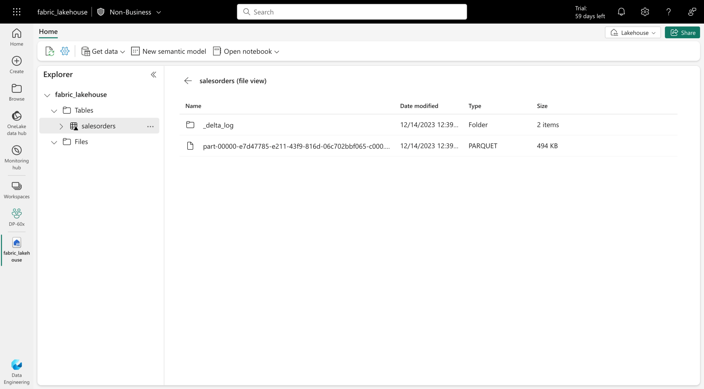
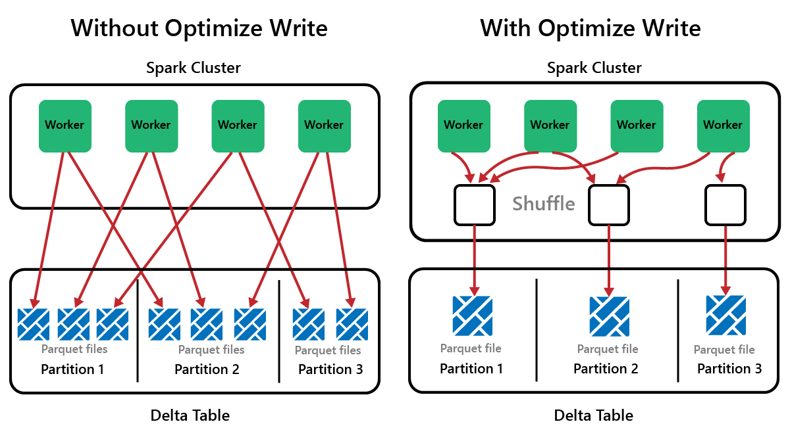
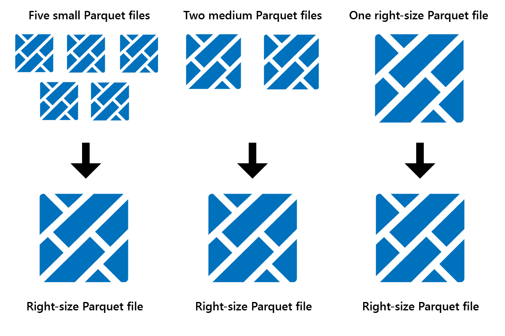
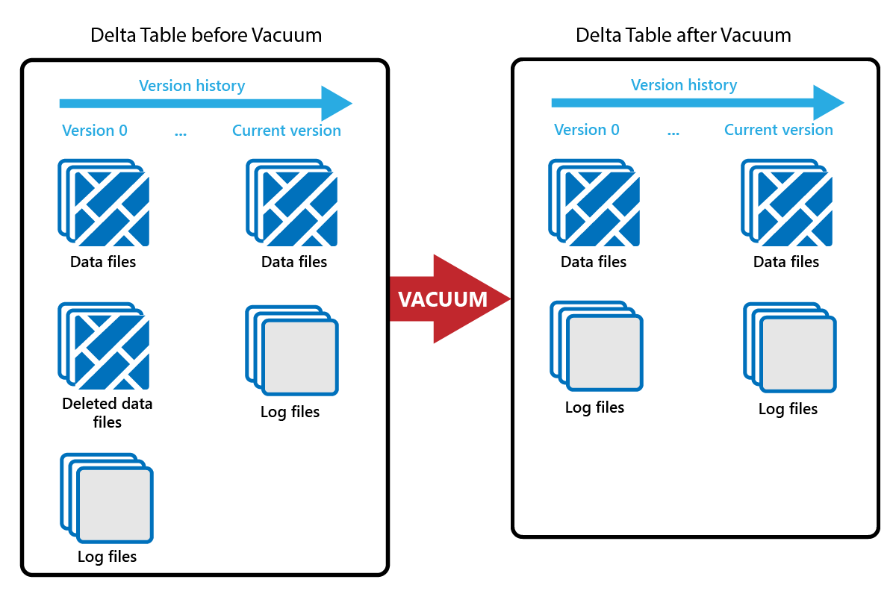
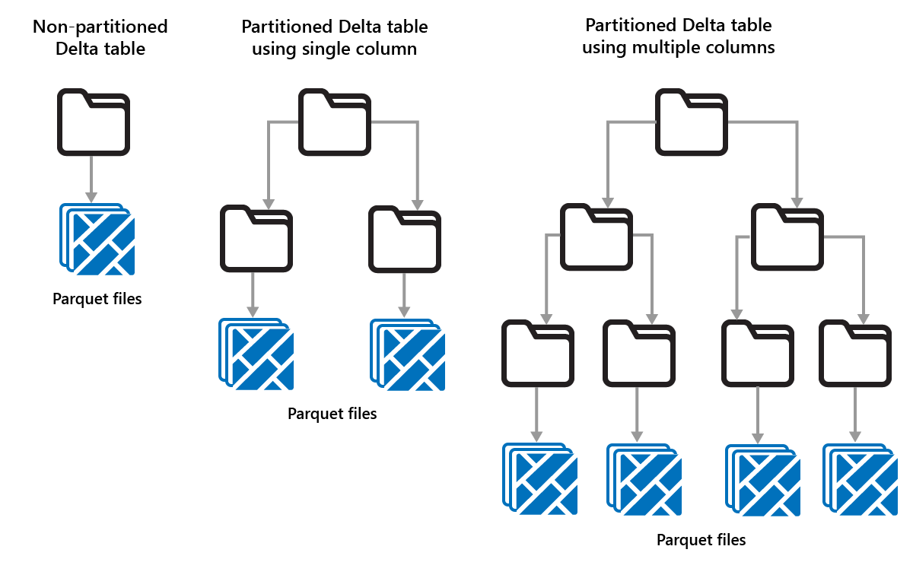
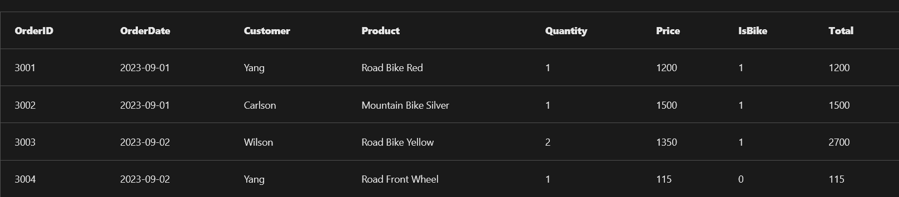

- [Module](https://learn.microsoft.com/en-gb/training/modules/work-delta-lake-tables-fabric/)
- [Badge](https://learn.microsoft.com/api/achievements/share/en-gb/taniomi/A4VXF427?sharingId=BF42B601A1EE754B)
- # Introduction
	- Tables in MS Fabric actually use a Linux table format called *Delta Lake*.
	- This format allows for storing batch and streaming data and is commonly used with Apache Spark, so storing data in *Delta Lake* format tables allows for queries in Spark.
	- Basically, we can use Apache to perform SQL - like a relational database - and we can also have flexibility in storage - like a data lake.
- # Understand Delta Lake
	- *Delta Lake* is an open-source storage layer that adds relational database semantics to Spark-based data lake processing.
	- Tables in Microsoft Fabric lakehouses are Delta tables, which is signified by the triangular Delta (**Δ**) icon on tables in the lakehouse user interface.
	- Delta tables are schema abstractions over data files that are stored in Delta format. For each table, the lakehouse stores a folder containing *Parquet* data files and a **_delta_Log** folder in which transaction details are logged in JSON format.
	- 
	- The benefits of using Delta tables include:
		- **Relational tables that support querying and data modification**. With Apache Spark, you can store data in Delta tables that support *CRUD* (create, read, update, and delete) operations. In other words, you can *select*, *insert*, *update*, and *delete* rows of data in the same way you would in a relational database system.
		- **Support for *ACID* transactions**. Relational databases are designed to support transactional data modifications that provide *atomicity* (transactions complete as a single unit of work), *consistency* (transactions leave the database in a consistent state), *isolation* (in-process transactions can't interfere with one another), and *durability* (when a transaction completes, the changes it made are persisted). Delta Lake brings this same transactional support to Spark by implementing a transaction log and enforcing serializable isolation for 
		  concurrent operations.
		- **Data versioning and time travel**. Because all transactions are logged in the transaction log, you can track multiple versions of each table row and even use the *time travel* feature to retrieve a previous version of a row in a query.
		- **Support for batch and streaming data**. While most relational databases include tables that store static data, Spark includes native support for streaming data through the Spark Structured Streaming API. Delta Lake tables can be used as both *sinks* (destinations) and *sources* for streaming data.
		- **Standard formats and interoperability**. The underlying data for Delta tables is stored in Parquet format, which is commonly used in data lake ingestion pipelines. Additionally, you can use the SQL analytics endpoint for the Microsoft Fabric lakehouse to query Delta tables in SQL.
- # Create delta tables
- ## Creating a delta table from a dataframe
	- id:: 67d4587f-c1f9-405a-a5ca-85c96e9df012
	  ```python
	  # Load a file into a dataframe
	  df = spark.read.load('Files/mydata.csv', format='csv', header=True)
	  
	  # Save the dataframe as a delta table
	  df.write.format("delta").saveAsTable("mytable")
	  ```
	- The data for the table is saved in Parquet files (regardless of the format of the source file you loaded into the dataframe) in the **Tables** storage area in the lakehouse, along with a **_delta_log** folder containing the transaction logs for the table (that allows data versioning and time travel).
	- The table is listed in the **Tables** folder for the lakehouse in the **Data explorer** pane.
- ## *Managed*  vs  *external*  tables
	- The example [above](((67d4587f-c1f9-405a-a5ca-85c96e9df012))) saves a *managed* table.
	- Being a *managed* table means that the Spark runtime will take care of the metadata and the data files. This also means that deleting the table will delete the files from the storage **Tables** in the lakehouse.
	- With an *external* table, the metadata, the relational table definition, will be mapped to another file storage.
	- E.g.: the code below creates an *external* table from a folder in the **Files** storage location.
	- ```python
	  df.write.format("delta").saveAsTable("myexternaltable", path="Files/myexternaltable")
	  ```
	- With an *external* table, the metadata is stored in the **Tables**, just as with a *managed* table, but the Parquet data files and JSON log files are stored in the external path (and will be shown in that external path node in the Lakehouse explorer pane - a map?).
	- Deleting an external table from the lakehouse metastore <u>doesn't delete</u> the associated data files.
	- Deleting a managed table from the lakehouse metastore <u>deletes</u> the associated data files.
- ## Creating table metadata
	- Instead of creating a table from existing data, define the table in the metastore and then populate it with data later.
- ### Use the *DeltaTableBuilder* API
	- Use PySpark to create a table with specified name and columns.
	- ```python
	  from delta.tables import *
	  
	  DeltaTable.create(spark) \
	    .tableName("products") \
	    .addColumn("Productid", "INT") \
	    .addColumn("ProductName", "STRING") \
	    .addColumn("Category", "STRING") \
	    .addColumn("Price", "FLOAT") \
	    .execute()
	  ```
- ### Use Spark SQL
	- Use Spark SQL DDL (Data Definition Language).
	- ```sql
	  %%sql
	  
	  CREATE TABLE salesorders
	  (
	      Orderid INT NOT NULL,
	      OrderDate TIMESTAMP NOT NULL,
	      CustomerName STRING,
	      SalesTotal FLOAT NOT NULL
	  )
	  USING DELTA
	  ```
	- By default, it creates a *managed* table. To create an *external* table, include the `LOCATION` parameter.
	- ```sql
	  %%sql
	  
	  CREATE TABLE MyExternalTable
	  USING DELTA
	  LOCATION 'Files/mydata'
	  ```
	- The schema of the table is determined by the Parquet files with data in the specified location.
- ## Saving data in delta format
	- Save data in delta format without creating a table definition in the metastore.
	- Useful when: you want to persist the results of data transformations performed with Spark and later use a table definition or simply use the data later
	- ```python
	  delta_path = "Files/mydatatable"
	  df.write.format("delta").save(delta_path)
	  ```
	- These *delta files* are saved in Parquet and include the folder **_delta_log**with JSON logs with transaction data.
	- It is possible to add rows from a df to an existing folder:
	- ```python
	  new_rows_df.write.format("delta").mode("append").save(delta_path)
	  ```
- # Optimize delta tables
	- **The small file problem:** Spark is parallel-processing framework, and has data stored on one or more nodes. Parquet files are immutable and every update or delete generates a new file. In the end, we can get lots of small files and the queries are slow or fail to complete.
- ## OptimizeWrite function
	- **OptimizeWrite:** feature of DeltaLake that write one bigger file instead of multiple smaller ones.
	- 
- ## Optimize
	- Table maintenance feature that joins small Parquet files into larger files.
	- You might run Optimize after loading large tables, resulting in:
		- fewer larger files
		- better compression
		- efficient data distribution across nodes
	- 
	- To run Optimize:
		- In **Lakehouse Explorer**, select the ... menu beside a table name and select **Maintenance**.
		- Select **Run OPTIMIZE command**.
		- Optionally, select **Apply V-order to maximize reading speeds in Fabric**.
		- Select **Run now**.
- ### V-Order function
	- Option when running *Optimize*.
	- Enabled by default.
	- Can increase write time by 15%, but enables way faster reads.
	- Can reduce network, disk and CPU resources when reading data.
	- V-Order works by applying special sorting, row group distribution, dictionary encoding, and compression on Parquet files. It's 100% compliant to the open-source Parquet format and all Parquet engines can read it.
- ## Vacuum
	- "Vacuum" old data files, keep transaction logs. You get to define a retention period.
	- To allow time travel, a new Parquet file is created every time there is an update or delete, and an entry is made in the transaction log.
	- 
	- You can also run **VACUUM** as a SQL command in a notebook:
	- ```python
	  %%sql
	  VACUUM lakehouse2.products RETAIN 168 HOURS;
	  ```
	- VACUUM commits to the Delta transaction log, so you can view previous runs in DESCRIBE HISTORY.
	- ```python
	  %%sql
	  DESCRIBE HISTORY lakehouse2.products;
	  ```
- ## Partitioning Delta tables
	- Organize data into partitions. Instead of going through all the data, check a specific relevant partition. Like a persistent `WHERE`.
	- E.g.: Partition sales data by year. Report on sales data for 2024, check only partition "year=2024". Like a glorified `WHERE`.
	- Partitions are a fixed data layout and don't adapt to different query patterns. When considering how to use partitioning, think about how your data is used, and its granularity.
	- Use partitioning when:
		- You have very large amounts of data.
		- Tables can be split into a few large partitions.
	- Don't use partitioning when:
		- Data volumes are small.
		- A partitioning column has high cardinality, as this creates a large number of partitions.
		- A partitioning column would result in multiple levels.
	- 
- # Work with delta tables in Spark
	- Ways to work with delta tables and delta format files.
- ## Using Spark SQL
	- [SQL Commands DDL, DML, etc](https://www.geeksforgeeks.org/sql-ddl-dql-dml-dcl-tcl-commands/)
	- 
	- In the code itself
	  ```python
	  spark.sql("INSERT INTO products VALUES (1, 'Widget', 'Acessories', 2.99)")
	  ```
	- In a notebook
	  ```sql
	  %%sql
	  
	  UPDATE products
	  SET Price = 2.49 WHERE ProductId = 1;
	  ```
- ## Use the Delta API
	- Use the Delta API to create a DeltaTable from files and then modify the data (like importing a .csv to a df and then saving it back as a .csv).
	- ```python
	  from delta.tables import *
	  from pyspark.sql.functions import *
	  
	  # Create a DeltaTable object
	  delta_path = "Files/mytable"
	  deltaTable = DeltaTable.forPath(spark, delta_path)
	  
	  # Update the table (reduce price of accessories by 10%)
	  deltaTable.update(
	      condition = "Category == 'Accessories'",
	      set = { "Price": "Price * 0.9" })
	  ```
- ## Use  *time travel*  to work with table versioning
	- You can see all the modifications made to a DeltaTable in the table *transaction log*.
	- See the history of a table
	  ```sql
	  %%sql
	  
	  DESCRIBE HISTORY products
	  DESCRIBE HISTORY 'Files/table' # external table
	  ```
	- Retrieve data from a specific version with `versionAsOf` or `timestampAsOf`
	  ```python
	  df = spark.read.format("delta").option("versionAsOf", 0).load(delta_path)
	  df = spark.read.format("delta").option("timestampAsOf", '2022-01-01').load(delta_path)
	  ```
- # Use delta tables with streaming data
	- Up until now, we viewed *static data* in files. Spark processes **streaming** and **batch** data through the same API.
- ## Spark Structured Streaming
	- Typical streaming solution:
		- Read data from a **source** constantly
		- Process data to perform some transformations, aggregations, filter fields, etc. (optional)
		- Write data to a **sink**
	- Spark Structured Streaming is a Spark API that deals with streaming data.
	- The Spark Structured Streaming Dataframe is a boundless dataframe that receives data continuously from directory paths, Kafka, network ports and other sources.
- ## Streaming with Delta tables
	- Delta tables can be both sources or sinks of streaming data.
	- E.g.: store IoT data from a sensor to a Delta table (sink), and then read that Delta to feed another application (source), or query the table (source).
- ### Using a Delta table as a streaming source
	- In the following PySpark example, a Delta table is created to store details of Internet sales orders:
	  ```sql
	  %%sql
	  CREATE TABLE orders_in
	  (
	          OrderID INT,
	          OrderDate DATE,
	          Customer STRING,
	          Product STRING,
	          Quantity INT,
	          Price DECIMAL
	  )
	  USING DELTA;
	  ```
	- A hypothetical data stream of internet orders is inserted into the orders_in table:
	  ```sql
	  %%sql
	  INSERT INTO orders_in (OrderID, OrderDate, Customer, Product, Quantity, Price)
	  VALUES
	      (3001, '2024-09-01', 'Yang', 'Road Bike Red', 1, 1200),
	      (3002, '2024-09-01', 'Carlson', 'Mountain Bike Silver', 1, 1500),
	      (3003, '2024-09-02', 'Wilson', 'Road Bike Yellow', 2, 1350),
	      (3004, '2024-09-02', 'Yang', 'Road Front Wheel', 1, 115),
	      (3005, '2024-09-02', 'Rai', 'Mountain Bike Black', 1, NULL);
	  ```
	- To verify, you can read and display data from the input table:
	  ```python
	  # Read and display the input table
	  df = spark.read.format("delta").table("orders_in")
	  
	  display(df)
	  ```
	- The data is then loaded into a streaming DataFrame from the Delta table:
	  ```python
	  # Load a streaming DataFrame from the Delta table
	  stream_df = spark.readStream.format("delta") \
	      .option("ignoreChanges", "true") \
	      .table("orders_in")
	  ```
	- > When using a Delta table as a streaming source, only *append* operations can be included in the stream. Data modifications can cause an error unless you specify the `ignoreChanges` or `ignoreDeletes` option.
	- You can check that the stream is streaming by using the `isStreaming` property which should return True:
	  ```python
	  # Verify that the stream is streaming
	  stream_df.isStreaming
	  ```
- ### Transform the data stream
	- Using the Spark Structured Streaming API, we can transform data in a streaming fashion and have a near-real-time visualization.
	- In this example, any rows with NULL in the Price column are filtered and new columns are added for IsBike and Total.
	  ```python
	  from pyspark.sql.functions import col, expr
	  
	  transformed_df = stream_df.filter(col("Price").isNotNull()) \
	      .withColumn('IsBike', expr("INSTR(Product, 'Bike') > 0").cast('int')) \
	      .withColumn('Total', expr("Quantity * Price").cast('decimal'))
	  ```
- ### Using a Delta table as a streaming sink
	- ```python
	  # Write the stream to a delta table
	  output_table_path = 'Tables/orders_processed'
	  checkpointpath = 'Files/delta/checkpoint'
	  deltastream = transformed_df.writeStream.format("delta").option("checkpointLocation", checkpointpath).start(output_table_path)
	  
	  print("Streaming to orders_processed...")
	  ```
	- > The `checkpointLocation` option is used to write a checkpoint file that tracks the state of the stream processing. This file enables you to recover from failure at the point where stream processing left off.
	- While the streaming is happening, we can query the Delta Lake table to see the output data.
	  ```sql
	  %%sql
	  SELECT *
	      FROM orders_processed
	      ORDER BY OrderID;
	  ```
	- The desired results should exclude order 3005 because of the NULL in column Price and the two new columns added in the transformation should appear (IsBike and Total).
	  
	- When finished, stop the streaming data to avoid unnecessary processing costs using the stop method:
	  ```python
	  # Stop the streaming data to avoid excessive processing costs
	  deltastream.stop()
	  ```
- # Exercise - Use delta tables in Apache Spark
	- [Launch Exercise](https://go.microsoft.com/fwlink/?linkid=2259245)