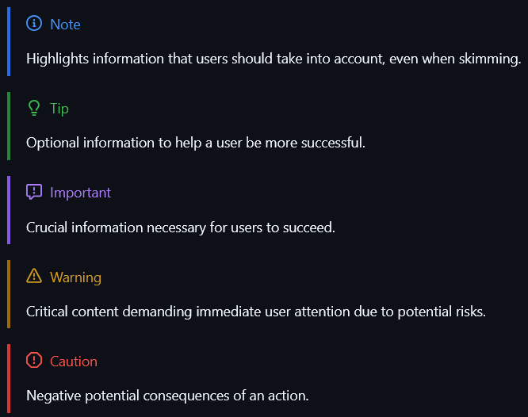

tags:: [[docs]]

- ### Highlights with tags (Note, Tip Important, Warning, Caution)[^1]
	- ```markdown
	  > [!NOTE]
	  > Highlights information that users should take into account, even when skimming.
	  
	  > [!TIP]
	  > Optional information to help a user be more successful.
	  
	  > [!IMPORTANT]
	  > Crucial information necessary for users to succeed.
	  
	  > [!WARNING]
	  > Critical content demanding immediate user attention due to potential risks.
	  
	  > [!CAUTION]
	  > Negative potential consequences of an action.
	  ```
	- 
- ---
- [^1]: https://github.com/orgs/community/discussions/16925